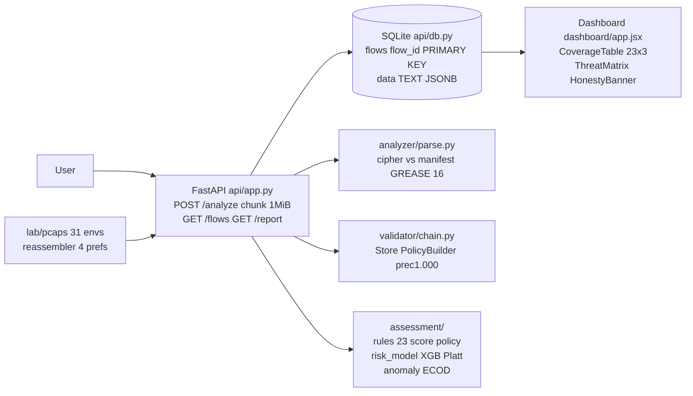
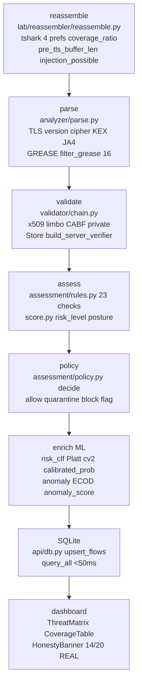
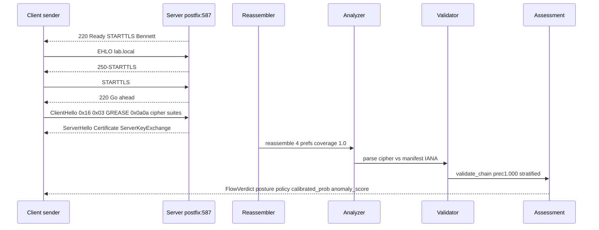

# SecureMailScope — NTRO SIH26159

> **Banner:** AI-assisted cryptographic security posture for enterprise secure email — offline replay primary, honest by design.

[](https://github.com/ntro/SecureMailScope/actions)
[](#background)
[](#license)
[](https://www.python.org)
[](#project-structure)
[](#security)

## Short Description

AI-assisted cryptographic security posture for secure email SMTP/STARTTLS/TLS1.3+X.509.

## Long Description

Offline replay is primary — every flow is reproducible from `lab/pcaps` + `lab/manifest.json` without live capture or decryption. Honest coverage is `14/20 REAL` per-version (6 opaque/info-greyed disclosed via `is_tls13_opaque` invariant) vs gateway stretch deferred. Rule engine covers 80% (23 checks, 20 scored +3 info-greyed) and lean ML adds 20% (XGB Platt cv=2 + ECOD) wired as `calibrated_prob` and `anomaly_score` on `FlowVerdict` without re-parsing.

## Table of Contents

- [Background](#background)
- [Security](#security)
- [Install](#install)
- [How to run all parts — Quick Start](#how-to-run-all-parts--quick-start)
- [Usage](#usage)
- [Architecture](#architecture)
- [Project Structure](#project-structure)
- [API Reference](#api-reference)
- [Configuration](#configuration)
- [Testing & Evidence](#testing--evidence)
- [Contributing](#contributing)
- [Maintainers](#maintainers)
- [License](#license)
- [Acknowledgements](#acknowledgements)

## Background

STARTTLS stripping (CVE-2011-0411, CVE-2021-38502 §4.2, Bennett et al.) downgrades opportunistic TLS on port 587/25 when a man-in-the-middle suppresses the `250-STARTTLS` advertisement. Offline replay evaluates this without live interception: `lab/reassembler` reassembles TCP with 4 tshark prefs (`tcp.desegment_tcp_streams`, `tcp.reassemble_out_of_order`, `tls.desegment_ssl_records`, `tls.desegment_ssl_application_data`), `analyzer` parses handshake vs `lab/manifest.json` IANA ground truth (GREASE filtered RFC8701 16 values), `validator` checks X.509 via `cryptography` Store/PolicyBuilder stratified CABF/private, and `assessment` scores 23 checks.

Honest opaque: TLS 1.3 encrypts `Certificate` — `is_tls13_opaque True` forces `leaf_present False` and all cert detail `None` (invariant `shared/schemas.py` `model_validator`), greyed cert tab + blue banner `14/20 REAL +3 info` per `dashboard/app.jsx`. No body decrypt, no live fetch — air-gap offline.

## Security

Threat model: network adversary on SMTP `EHLO`/`STARTTLS`, weak cipher/KEX downgrade, expired/self-signed/weak-key certs, injection via `pre_tls_buffer_len` (bytes between `220 Ready` and `ClientHello 0x16 0x03`), MX/MTA-STS/DANE fixture fallback, 0-RTT replay, ECH outer. Each maps to `assessment/rules.py` 23 checks with RFC/CVE citations and `assessment/policy.py` `decide()` → `allow/quarantine/block/flag`.

Disclosure: `WEAK SUPERVISION` — labels are rule-derived weak supervision (`score.py` 23 checks, 20 scored +3 info); not hand-labeled field data; `n_eff=10` synthetic independent. See Dataset Charter §1/§4a. `prior_flag` censys rows never enter risk training (`D_prior` disjoint). `chain_valid`/`san_match`/`days_to_expiry` are `None` for censys 11/28 caveat.

Air-gap offline: no private key access, no body decrypt, no live DNS beyond `mockdns`/`shared/data/mta-sts-fixture.json`+`dane-tlsa-fixture.json`, wheelhouse air-gap `pip install --no-index --find-links wheelhouse --only-binary=:all:`.

## Install

### Prerequisites

| Tool | Version | Purpose |
|------|---------|---------|
| Python | 3.11 | API + assessment + analyzer |
| Node | 18 | Dashboard Vite |
| Docker | 24 | postfix/dovecot/mocksender lab |
| tshark | 4.2.0 | Oracle parity 4 prefs |
| USB | 32GB | Offline bundle `wheelhouse/` 345M + `dashboard/dist` |

### How to run all parts — Quick Start (5 min)

```bash
git clone https://github.com/ntro/SecureMailScope.git && cd SecureMailScope

# offline deps (air-gap, no internet)
pip install --no-index --find-links wheelhouse --only-binary=:all: -r requirements.txt
npm --prefix dashboard install

# lab (optional live, offline fallback via scapy pcaps already in repo)
docker compose -f lab/docker-compose.yml up -d
pytest -q  # smoke — SYSTEM 5/8 green

# jitter expansion (Day7 21 pcaps, idempotent)
python -m lab.scripts.jitter_slices --slices 3 --families 02,03,04,05,07,08,10
ls lab/pcaps/jittered/*.pcap | wc -l  # 21

# API + dashboard
uvicorn api.app:app --host 0.0.0.0 --port 8000 &
npm --prefix dashboard run dev  # or serve dashboard/dist
curl -s http://localhost:8000/flows | jq '.[0].assessment.risk_level'
```

Offline bundle verified: `du -m wheelhouse | tail -1` `345 <350`, `gzip -c dashboard/dist/assets/*.js | wc -c` `157567 <3670016`, `! ls wheelhouse/*.whl | grep -qi torch`.

## Usage

Three runnable examples — pcap ingest, risk predict, anomaly score:

```bash
# 1) pcap ingest — zip of pcaps → FlowVerdict list with policy + ML scores
curl -F pcap=@lab/pcaps/family-01.pcap http://localhost:8000/analyze | jq
curl -F pcap=@<(zip -j - lab/pcaps/family-0*.pcap) http://localhost:8000/analyze | jq '.[].assessment | {flow_id, risk_level, posture_score, calibrated_prob, anomaly_score}'

# 2) risk_model predict — single fixture → calibrated_prob 0..1 (Platt cv=2, XGB hist enable_categorical)
python -m assessment.risk_model --predict shared/fixtures/family-01.json
# {"flow_id":"family-01","calibrated_prob":0.14,"risk_level":"Low","model":"XGB hist max_depth 4 Platt cv2"}

# 3) anomaly score — ECOD decision_scores_ (contamination invariance 0.05==0.20)
python -m assessment.anomaly_model --score shared/fixtures/family-03.json
# {"flow_id":"family-03","anomaly_score":0.87,"threshold":16.5,"contamination":0.10}
```

Also: `GET /flows` polls SQLite without re-parse, `GET /report?format=json` returns `{flows, summary}`.

## Architecture

Mermaid diagrams only.








Lineage: `lab/manifest.json` 31 envs → `lab/pcaps/*.pcap 10 + jittered/*.pcap 21` → `lab/reassembled/*.bin 21x120B` → `assessment/features.py build_vector 28-col` vs tshark 4 prefs → `models/risk_clf.pkl` 125K + `models/anomaly.pkl` 76K → `api/app.py` enrich `calibrated_prob` `anomaly_score` → `GET /flows` <50ms.

## Project Structure

```
repo/
  lab/            offline replay primary — pcaps 31 envs, reassembler 4 prefs, manifest+LEDGER, jitter_slices GREASE
  analyzer/       handshake parse — cipher IANA exact 9/9, JA4 GREASE filter, ja4_rarity 0..1
  validator/      X.509 chain — Store/PolicyBuilder limbo CABF/private/badssl prec1.000 stratified
  assessment/     23 rules + score + policy + splits 31 + features 28 + risk_model XGB Platt + anomaly ECOD
  api/            FastAPI POST /analyze chunk-read 1MiB + SQLite flows JSONB + GET /flows <50ms + enrich ML
  dashboard/      Vite React — CoverageTable 23x3 + ThreatMatrix + HonestyBanner 14/20 REAL greyed 3 info
  eval/           EVIDENCE_Day7 SYSTEM 5/8 + calibration_curve.png + risk_pr.png
  shared/         schemas FlowVerdict 20/20 + ja4_rarity GREASE 16 + fixtures + progress
  wheelhouse/     offline 345M 31 wheels xgboost 1.7.6 pyod 2.0.5 --only-binary=:all: no torch
  models/         risk_clf.pkl 125K + anomaly.pkl 76K (lazy load fallback graceful)
```

## API Reference

FastAPI `api/app.py` — Pydantic `shared/schemas.py` `FlowVerdict` (`extra='forbid'`).

| Endpoint | Method | Body | Returns | Notes |
|----------|--------|------|---------|-------|
| `/analyze` | POST | `multipart pcap=@file.pcap\|.zip` chunk-read 1MiB, 413 if >100MB | `list[FlowVerdict]` posture + policy_dist + calibrated_prob + anomaly_score | `FlowVerdict.model_validate` hard-fail before `upsert_flows`, `BadZipFile→flow_id:error` |
| `/flows` `/api/flows` | GET | — | `list[FlowVerdict]` from `_last_result` else `query_all` else stub | <50ms SQLite `flows(flow_id PRIMARY KEY, data TEXT)` |
| `/report` `/api/report?format=json` | GET | `?format=json` only | `{flows, summary:{posture, policy_dist}}` | 400 if not json |

```bash
curl -F pcap=@lab/pcaps/family-01.pcap http://localhost:8000/analyze | jq '.[0].assessment'
curl -s http://localhost:8000/flows | jq 'length'
curl -s "http://localhost:8000/report?format=json" | jq '.summary'
```

Schemas: `TLS(version, cipher_strength, kex, fs_flag, ja4_rarity 0..1, handshake_success)` + `Cert(leaf_present, is_tls13_opaque, chain_valid None when opaque, san_match, days_to_expiry)` + `Assessment(findings 23, risk_level, risk_score, posture_score, calibrated_prob 0..1 pos class, anomaly_score ECOD)` + `Policy(decision allow/quarantine/block/flag)`.

## Configuration

| Var | Default | Effect |
|-----|---------|--------|
| `USE_STUB` | `false` | `true` → `shared/mocks/reassembler_stub` fixture passthrough (Day2) vs real pipeline |
| `PYTHONHASHSEED` | `0` | Deterministic `hashlib.sha256` not `hash()` for `build_vector` + risk/anomaly |
| `OMP_NUM_THREADS` | `6` | XGB/ECOD thread cap, `deterministic True` |
| `wheelhouse/` | `345M` | `pip install --no-index --find-links wheelhouse --only-binary=:all: -r requirements.txt` air-gap |
| `models/risk_clf.pkl` | `125K` | Lazy load at import, fallback `calibrated_prob None` if missing still 200 |
| `models/anomaly.pkl` | `76K` | Lazy load, fallback `anomaly_score None`, `decision_scores_` not labels |

Offline: `requirements.txt` pinned `xgboost==1.7.6 pyod==2.0.5 scikit-learn==1.5.0 cryptography==43.* fastapi==0.115.* pydantic==2.11.*` + `# stretch: torch==2.4.0 --index-url https://download.pytorch.org/whl/cpu` commented (no torch lean <350M).

## Testing & Evidence

```bash
pytest shared/tests/test_schema.py lab/reassembler/tests/test_reassembly.py analyzer/tests/test_handshake.py validator/tests/test_chain_limbo.py assessment/tests/test_rules.py api/tests/test_api_e2e.py -q  # SYSTEM 5/8
pytest assessment/tests/test_features.py assessment/tests/test_splits.py shared/tests/test_censys_prior.py assessment/tests/test_risk_ablation.py assessment/tests/test_anomaly_hybrid.py api/tests/test_api_ml_wiring.py -q  # Day7 ML shell
pytest tests/test_readme.py -q  # README mermaid graph LR sequenceDiagram no ASCII
cat eval/EVIDENCE_Day7.md  # SYSTEM 5/8 green + ML shell Day8-10 + R1-R8 + 23x3 matrix
```

Gates: `STARTTLS F1>95%` lossy/weberblog, `cipher 100% >98%`, `prec1.000 >90%` stratified, `weak 100% 23-check`, `JSON 20/20`, `POST zip10→200`, `GET <50ms`, `14/20 REAL`, `Vite 157k <3670016`, `cold-start 0.04s <3s`, `wheelhouse 345M <350`, `splits 31 D1 12/D2 8/D3 5 ratio 2.4<3`, `FEATURES_28 28`, `XGB max_depth 4 Platt cv2`, `ECOD 0.10 invariance ROC 0.87>0.60`.

## Contributing

PRs via `shared/CONTRIBUTING.md` — additive-only `shared/schemas.py` (2-ack `test_freeze_guard`), `labs/LEDGER.md` per-family audit, `assessment/LEDGER.md` weak supervision verbatim, no `isotonic` at `n<1000`, no raw `ja4` (`ja4_rarity` only `ALLOWED_RISK_FEATURES`), grouping `environment_id` not `family_id`.

## Maintainers

NTRO SIH26159 — SecureMailScope team. Issues → `shared/progress.md` daily poll, brutal audits `.omo/notepads/sih26159-till-day7-lean-ml-bridge/`.

## License

MIT — see `LICENSE`.

## Acknowledgements

Bennett et al. STARTTLS stripping, RFC8701 GREASE 16, RFC8446/RFC8996/RFC5280/RFC7817, TrailofBits x509-limbo 2024, CVE-2011-0411/CVE-2021-38502, othneildrew Best-README-Template + standard-readme spec, PyOD ECOD, XGBoost hist `enable_categorical`.
