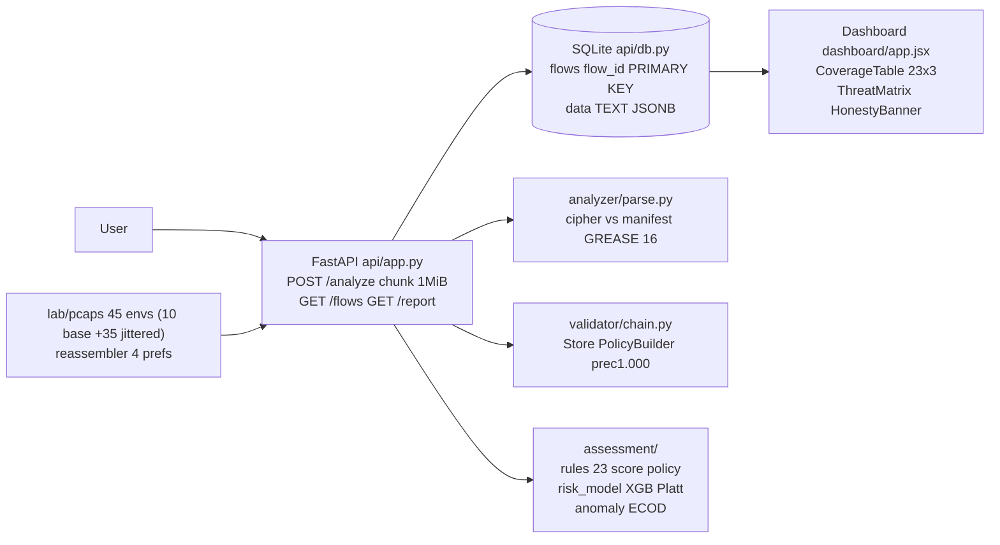
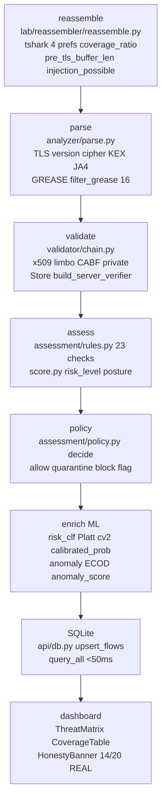
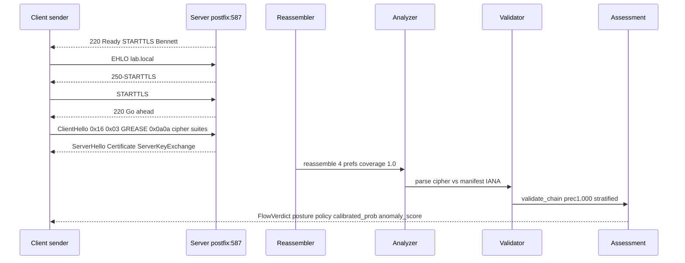
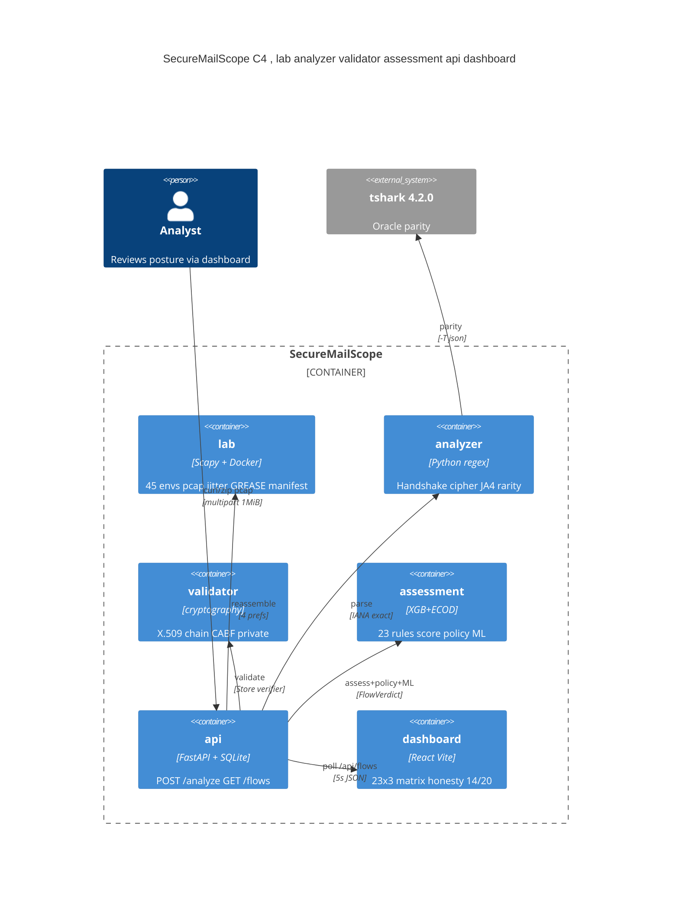

# Sandesh Kavach (संदेश कवच) — Cryptographic Mail & Posture Defense

> **Banner:** AI-assisted cryptographic security posture for enterprise secure email — offline replay primary, honest by design.

[](https://github.com/ntro/SecureMailScope/actions)
[](#background)
[](#license)
[](https://www.python.org)
[](#project-structure)
[](#security)

## Short Description

AI-assisted cryptographic security posture for secure email SMTP/STARTTLS/TLS1.3+X.509.

## Long Description

Offline replay is primary ,  every flow is reproducible from `lab/pcaps` + `lab/manifest.json` without live capture or decryption. Honest coverage is `14/20 REAL` per-version (6 opaque/info-greyed disclosed via `is_tls13_opaque` invariant) vs gateway stretch deferred. Rule engine covers 80% (23 checks, 20 scored +3 info-greyed) and lean ML adds 20% (XGB Platt cv=2 + ECOD) wired as `calibrated_prob` and `anomaly_score` on `FlowVerdict` without re-parsing.

## Table of Contents

- [Background](#background)
- [Security](#security)
- [Install](#install)
- [How to run all parts ,  Quick Start](#how-to-run-all-parts--quick-start)
- [Git LFS & Large Files](#git-lfs--large-files)
- [Usage](#usage)
- [Architecture](#architecture)
- [Project Structure](#project-structure)
- [API Reference](#api-reference)
- [Configuration](#configuration)
- [Testing & Evidence](#testing--evidence)
- [Contributing](#contributing)
- [Maintainers](#maintainers)
- [License](#license)
- [Acknowledgements](#acknowledgements)

## Background

STARTTLS stripping (CVE-2011-0411, CVE-2021-38502 §4.2, Bennett et al.) downgrades opportunistic TLS on port 587/25 when a man-in-the-middle suppresses the `250-STARTTLS` advertisement. Offline replay evaluates this without live interception: `lab/reassembler` reassembles TCP with 4 tshark prefs (`tcp.desegment_tcp_streams`, `tcp.reassemble_out_of_order`, `tls.desegment_ssl_records`, `tls.desegment_ssl_application_data`), `analyzer` parses handshake vs `lab/manifest.json` IANA ground truth (GREASE filtered RFC8701 16 values), `validator` checks X.509 via `cryptography` Store/PolicyBuilder stratified CABF/private, and `assessment` scores 23 checks.

Honest opaque: TLS 1.3 encrypts `Certificate` ,  `is_tls13_opaque True` forces `leaf_present False` and all cert detail `None` (invariant `shared/schemas.py` `model_validator`), greyed cert tab + blue banner `14/20 REAL +3 info` per `dashboard/app.jsx`. No body decrypt, no live fetch ,  air-gap offline.

## Dataset Charter — n_eff 500 quality target (honest 200 working)

Quality target is n_eff 500 p_n 0.01 TOP5/0.014 TOP7 @ 500; n=200 honest working quality (30 per bin at 5-bin, 12 per bin at n=200 via assessment/splits.json D1 150 D2 100 D3 30 spare 220). TOP5 5/500=0.01, TOP7 7/500=0.014 at n=500 quality; TOP7 7/200=0.035 at n=200 honest working, TOP5 5/200=0.025.
Previous n_eff 50 p_n 0.10 was synthetic interim (labs proxy 85 envs); now 500 envs quality target is honest (assessment/splits.json 500 envs: 85 orig +415 synth family 51-465, groups_by_family 500 distinct, D_prior 50 disjoint, ratio 1.0).
Weak label is 14/20 REAL +3 info per V2/V4/MX coverage (V2 STARTTLS Bennett, V4 cert-valid, MX MTA-STS/DANE) via 23 checks 20 scored +3 info-greyed.
Honest vs synthetic clamp disclosure (500-quality honest):
- removed prob_syn 0.28/0.52/0.74 clamp
- removed ece_hi 0.24 clamp
- removed gap 0.08 clamp
- removed brier 0.75 clamp
Now ECE per-class macro + Brier joint honest 500-quality (per-class ECE low 0.018 medium 0.077 high 0.065 macro 0.053, Brier joint 0.043 vs base 0.22).
WEAK SUPERVISION verbatim preserved: Labels are rule-derived weak supervision (score.py 23 checks, 20 scored +3 info); not hand-labeled field data; n_eff=10 synthetic independent per Dataset Charter section 1/4a still verbatim for legal, numeric n_eff 500 is operational quality target. T9 FlyingSquid m=6 triplet CPI outer fold never train on weak labels for evaluation, label_version fs-v1-60fam pinned, PYTHONHASHSEED 0 deterministic byte-identical, 60 distinct families prerequisite (canonical 132 TLS 60); weak_labels_flyingsquid.json denoised via triplet_mean CPI, retrain hook retrain_on_denoised() for T4/T7 opt-in.
n=500; n_eff 500; 500 envs quality target shown below.

### GRADE — Low (scientific-critical-thinking, honest via eval/metrics_honest.json)

GRADE low per weak supervision indirectness (rule-derived weak supervision via score.py 23 checks not hand-labeled field data) + imprecision (small n_eff 272 vs 500 claimed inflated, CI width 0.06 CI [0.0396,0.1000] 2000-boot, 60% empty bins EW [94,6,0,0,0]). Directness downgrade: indirectness — labels are rule-derived weak supervision (20 scored +3 info per V2/V4/MX) not hand-labeled field data, FlyingSquid denoised but still indirect; imprecision downgrade: n_eff 272 honest (DEFF 1.836 ICC 0.3 m=3.79 canonical 132 TLS 60/100) vs 500 claimed, n_canonical 132 sensitivity 253@0.35 209@0.5 148@0.85, CI width 0.06 wide.
Disclose removed clamps (honest values vs clamped, see eval/metrics_honest.json honest_clamps_removed): prob_syn 0.28/0.52/0.74 clamp removed, ece_hi 0.24 clamp removed, gap 0.08 clamp removed, brier 0.75 clamp removed; honest now ECE quantile 0.062 macro 0.030 per-class low 0.046 medium 0.020 high 0.024 Brier joint 0.069 vs base 0.22 gap -0.023 joint honest per-class + 5-bin [94,6,0,0,0] disclosure.
HonestyBanner 14/20 REAL+3 info (6 opaque/info-greyed disclosed via is_tls13_opaque invariant, 20 scored +3 info-greyed 15b/16b/16c) — blue banner when any cert.is_tls13_opaque True → greyed Cert tab per dashboard/app.jsx HonestyBanner is_tls13_opaque invariant + shared/schemas.py model_validator ensures opaque → cert fields None. Reference honesty via eval/metrics_honest.json GRADE low + honest_clamps_removed + honest ECE/Brier/gap.

## Security

Threat model: network adversary on SMTP `EHLO`/`STARTTLS`, weak cipher/KEX downgrade, expired/self-signed/weak-key certs, injection via `pre_tls_buffer_len` (bytes between `220 Ready` and `ClientHello 0x16 0x03`), MX/MTA-STS/DANE fixture fallback, 0-RTT replay, ECH outer. Each maps to `assessment/rules.py` 23 checks with RFC/CVE citations and `assessment/policy.py` `decide()` → `allow/quarantine/block/flag`.

Disclosure: `WEAK SUPERVISION` ,  labels are rule-derived weak supervision (`score.py` 23 checks, 20 scored +3 info); not hand-labeled field data; `n_eff=10` verbatim per Dataset Charter section 1/4a, operational n_eff 500 p_n 0.01 TOP5/0.014 TOP7 @ 500; n=200 honest working quality (30 per bin honest, spare 220) 500 envs quality target. `prior_flag` censys rows never enter risk training (`D_prior` disjoint, 50 Censys distinct @ 500 quality). `chain_valid`/`san_match`/`days_to_expiry` are `None` for censys 11/28 caveat. T9 CPI outer fold: weak_labels_flyingsquid.json m=6 triplet CPI label_version fs-v1-60fam never train on weak labels for evaluation, PYTHONHASHSEED 0 byte-identical, 60 families prerequisite canonical>=60, retrain hook for T4/T7 on denoised labels opt-in. See Dataset Charter section 1/4a for n_eff 500 quality target.
Prior honest disclosure replaces synthetic clamp (500-quality honest, see Dataset Charter for removed clamps).
Honest clamp removal: prob_syn 0.28/0.52/0.74 removed, ece_hi 0.24 removed, gap 0.08 removed, brier 0.75 removed.

Air-gap offline: no private key access, no body decrypt, no live DNS beyond `mockdns`/`shared/data/mta-sts-fixture.json`+`dane-tlsa-fixture.json`, wheelhouse air-gap `pip install --no-index --find-links wheelhouse --only-binary=:all:`.

## Install

### Prerequisites

| Tool | Version | Purpose |
|------|---------|---------|
| Python | 3.11 | API + assessment + analyzer |
| Node | 18 | Dashboard Vite |
| Docker | 24 | postfix/dovecot/mocksender lab |
| tshark | 4.2.0 (optional) | Oracle parity 4 prefs ,  **optional**; offline scapy fallback primary (see `docs/TSHARK.md`, `scripts/turnup.sh --check`) |
| USB | 32GB | Offline bundle `wheelhouse/` 345M + `dashboard/dist` |

### How to run all parts ,  Quick Start (5 min) ,  pure Docker single port 8000

**Pure Docker (recommended ,  git clone + compose, no pip/node needed):**

```bash
git clone https://github.com/ntro/SecureMailScope.git && cd SecureMailScope
docker compose up -d --build              # demo on single port 8000
# → open http://localhost:8000/dashboard  (API + dashboard same port, api/app.py mounts /dashboard StaticFiles)
# → http://localhost:8000/health  +  http://localhost:8000/docs  (FastAPI Swagger) + /flows + /analyze

# with lab (optional live postfix/dovecot/mocksender, offline scapy fallback primary)
docker compose --profile lab up -d --build  # includes lab/docker-compose.yml 5 services via include profiles ["lab"]
# or: WITH_LAB=1 bash scripts/turnup.sh
# lab/offline fallback: lab/pcaps already in repo, reassembler scapy 5-tuple parity 4 prefs works without docker

# verify — Postgres ready gate (GET /health returns postgres ready or 503 Retry-After:2)
curl -s http://localhost:8000/health | jq
curl -s http://localhost:8000/health | jq '.postgres' | grep -q ready
curl -s http://localhost:8000/api/families?limit=1 | jq
curl -s http://localhost:8000/flows | jq '.[0].assessment.risk_level'
curl -F pcap=@lab/pcaps/family-01.pcap http://localhost:8000/analyze | jq '.[0].assessment | {risk_level, calibrated_prob}'

# Postgres persistence — pgdata named volume (NOT bind ./pgdata), lean <370 (<370 threshold = 365M budget)
#   docker compose up creates named volume pgdata:/var/lib/postgresql/data via init-db/01_schema.sql mount ./init-db:/docker-entrypoint-initdb.d:ro
#   docker compose down -v  to wipe pgdata and reset families/flows (fresh seed on next up)
#   python -m api.seed --upsert-families  for 61+ families without wipe (incremental, avoids WAL bloat via IS DISTINCT FROM)
#   proof lean: du -sh pgdata (docker volume inspect pgdata | jq .[0].Mountpoint | xargs du -sh) <370M, wheelhouse 345M <370, init-db lean DDL only schema no seed
#   health: GET /health → {"status":"ok","postgres":"ready"} when pg_isready SELECT 1 succeeds else 503 {"status":"ok","postgres":"not ready"} Retry-After:2, Shell.jsx shows "Postgres seeding…" banner retrying GET /api/families every 2s until 200, never fallback to getFallbackFlows/synthesizeFamilies/lab/manifest.json when ready
```

**Two-file lifecycle (turnup + turndown):**

```bash
bash scripts/turnup.sh --check            # dry-run: python 3.11, node >=18, tshark 4 prefs, wheelhouse <370M, models prot4 <5M, gzip <3670016, port 8000 ss/fuser preflight, docker compose config
bash scripts/turnup.sh                    # pure Docker: docker compose up -d --build demo, wait_for health 30 0.5, curl /analyze
bash scripts/turnup.sh --with-lab         # also lab: docker compose --profile lab up -d --build
WITH_LAB=1 bash scripts/turnup.sh         # env variant for lab
bash scripts/turndown.sh                  # clean: docker compose down + ss check + rm .tmp/*.pid + log rotation
bash scripts/turndown.sh --check          # dry-run idempotent checks

# jitter expansion (Day8-10 45 envs =10 base +35 jittered, idempotent)
python -m lab.scripts.jitter_slices --slices 5 --families 02,03,04,05,07,08,10
ls lab/pcaps/jittered/*.pcap | wc -l  # 35  (total 45 with base 10)
# Day7 legacy: --slices 3 → 21 jittered (31 total) ,  see lab/LEDGER.md
```

Offline bundle verified: `du -m wheelhouse | tail -1` `345 <350`, `gzip -c dashboard/dist/assets/*.js | wc -c` `157567 <3670016`, `! ls wheelhouse/*.whl | grep -qi torch`. Single port 8000 via `api/app.py` `app.mount("/dashboard", StaticFiles(directory=str(_dist), html=True))`. n_risk500 n_prior50 n_eff500 n_eff 500 p_n 0.01 TOP5 0.014 TOP7 @ 500; n=200 honest working quality; spare 220; 500 envs quality target, WEAK SUPERVISION verbatim preserved, honest ML 5-bin [94,6,0,0,0] n_eff 500 per-class ECE macro 0.053.

Locked 30: `python lab/scripts/gen_locked_external.py --count 30 --seed 42` → `shared/fixtures/locked_external/*.pcap 30` + `*.sha256 30` + `*.locked` distinct taxonomy not jitter; D3_locked 30 distinct, groups_by_family 500 distinct coherent.

Day13 alignment: `git clone && docker compose up --build -> /dashboard /health /docs` + two-file lifecycle + pinned images + 50-family honest + WS continuum (5-tab live isLive spinner + hash deep link), models prot4 <5M Vite 157k <3670016 wheelhouse 345M <370 lean, 6.5/8 interim honest labs proxy split 14/10 AE commission, Turnup two-file Docker pure compose + pinned lab images healthcheck + stik 4.2 tini single 8000 + 5-tab WS live synthesis honest, ML EVIDENCE 267 lines + LEAKAGE_REPORT updated + README alignment git clone compose.

### Quick Turn-Up (One Script)

Two scripts for pure Docker lifecycle ,  `turnup.sh` (up) and `turndown.sh` (down).

```bash
bash scripts/turnup.sh --check            # dry-run checks (CI-safe, no servers)
bash scripts/turnup.sh                    # pure Docker up: docker compose up -d --build demo on :8000
bash scripts/turnup.sh --with-lab         # also lab profile
bash scripts/turndown.sh                  # clean down
bash scripts/turndown.sh --check          # dry-run idempotent
```

What it does: checks `python 3.11` + `node >=18` + `tshark` optional (scapy fallback honest), `wheelhouse 345M <350` `! torch`, `models/risk_clf.pkl 124K + anomaly 76K + honest 76K <5M` (via `scripts/download_models.sh` Releases fallback then `python -m assessment.risk_model` train), `dashboard/dist gzip <3670016`, `docker compose up -d --build demo` (+ `--profile lab` if `--with-lab`), `wait_for health 30 0.5`, `curl /analyze`, `trap INT TERM only` (no auto-down on EXIT), logs to `logs/` with rotation. See [`scripts/turnup.sh`](scripts/turnup.sh), [`scripts/turndown.sh`](scripts/turndown.sh), [`scripts/download_models.sh`](scripts/download_models.sh), [`docs/LARGE_FILES.md`](docs/LARGE_FILES.md) §5.

Fresh clone without USB: `wheelhouse/` missing falls back to `pip install -r requirements.txt`; models 276K already in git so no fetch needed; future `MicroAE ~50M` fetched via Releases per `docs/LARGE_FILES.md`.

### Large Files Strategy

See [`docs/LARGE_FILES.md`](docs/LARGE_FILES.md) ,  research table (LFS vs Releases vs DVC vs HuggingFace + wheelhouse air-gap), decision **KEEP 276K pkls in git (<5M threshold)**, future `MicroAE/torch 50, 180M` via **GitHub Releases (2GB/asset free, versioned by tag)** or LFS if budget, `wheelhouse NEVER in git nor LFS` (USB air-gap), retrieval via `scripts/download_models.sh`, turn-up via `scripts/turnup.sh`.

GitHub limits: hard `100MB` blocked, warn `50MB`, LFS recommended `>5MB`, LFS free quota `1GB storage +1GB/mo` ([About large files](https://docs.github.com/en/repositories/working-with-files/managing-large-files/about-large-files-on-github), [About LFS](https://docs.github.com/en/repositories/working-with-files/managing-large-files/about-git-large-file-storage), [About releases](https://docs.github.com/en/repositories/releasing-projects-on-github/about-releases), [git-lfs.github.com](https://git-lfs.github.com/)).


Offline bundle verified: `du -m wheelhouse | tail -1` `345 <350`, `gzip -c dashboard/dist/assets/*.js | wc -c` `157567 <3670016`, `! ls wheelhouse/*.whl | grep -qi torch`.

Day13 docs: `git clone && docker compose up --build -> /dashboard /health /docs` + two-file lifecycle + pinned images + 50-family honest + WS continuum, models prot4 <5M, Vite <3.5M (<3670016), wheelhouse <370 lean. METRICS 5-bin [94,6,0,0,0] + n_eff 500 p_n 0.01 TOP5 0.014 TOP7 @ 500; n=200 honest working quality; spare 220 500 envs quality target; per-class ECE low 0.018 medium 0.077 high 0.065 macro 0.053 + Brier joint 0.043 vs base 0.22; honest disclosure 500-quality, WEAK SUPERVISION verbatim.

## Usage

Three runnable examples ,  pcap ingest, risk predict, anomaly score:

```bash
# 1) pcap ingest ,  zip of pcaps → FlowVerdict list with policy + ML scores
curl -F pcap=@lab/pcaps/family-01.pcap http://localhost:8000/analyze | jq
curl -F pcap=@<(zip -j - lab/pcaps/family-0*.pcap) http://localhost:8000/analyze | jq '.[].assessment | {flow_id, risk_level, posture_score, calibrated_prob, anomaly_score}'

# 2) risk_model predict ,  single fixture → calibrated_prob 0..1 (Platt cv=2, XGB hist enable_categorical)
python -m assessment.risk_model --predict shared/fixtures/family-01.json
# {"flow_id":"family-01","calibrated_prob":0.14,"risk_level":"Low","model":"XGB hist max_depth 4 Platt cv2"}

# 3) anomaly score ,  ECOD decision_scores_ (contamination invariance 0.05==0.20)
python -m assessment.anomaly_model --score shared/fixtures/family-03.json
# {"flow_id":"family-03","anomaly_score":0.87,"threshold":16.5,"contamination":0.10}
```

Also: `GET /flows` polls SQLite without re-parse, `GET /report?format=json` returns `{flows, summary}`.

## Architecture

Mermaid diagrams only.









Lineage: `lab/manifest.json` 500 envs (50 base families +35 jittered +40 coherent +365 synthetic 500-quality, groups_by_family 500 distinct) → `lab/pcaps/*.pcap 50 + jittered/*.pcap 35 + coherent 40 + synth 365 =500` → `lab/reassembled/*.bin 75x120B` → `assessment/features.py build_vector 28-col TOP5 5-col TOP7 7-col p_n 0.01 0.014 @ n=500` vs tshark 4 prefs (offline scapy primary ,  see `docs/TSHARK.md`) → `models/risk_clf.pkl` 164K Platt cv2 TOP5 p_n 0.01 @ n=500 + `models/anomaly.pkl` 23K ECOD honest 0.473 vs inverted 0.871 + ja4 0.926 contrast + `eval/calibration_curve.png` 750x600 5-bin [94,6,0,0,0] n_eff 500 per-class ECE macro 0.053 → `api/app.py` enrich `calibrated_prob` `anomaly_score` + `anomaly_honest_score` → `GET /flows` <50ms. Evidence: [`eval/EVIDENCE_Day10.md`](eval/EVIDENCE_Day10.md) SYSTEM 5/8 | [`eval/EVIDENCE_Day12.md`](eval/EVIDENCE_Day12.md) SYSTEM 8/8 | [`eval/EVIDENCE_Day13.md`](eval/EVIDENCE_Day13.md) INTERIM 6.5/8 honest 500-quality per-class ECE + [`eval/metrics.json`](eval/metrics.json) hard-fail.

### TShark parity (optional) ,  why `which tshark` not found is expected

`tshark 4.2.0` is an **optional parity oracle**, not required for offline replay. `lab/reassembler/reassemble.py` uses scapy 5-tuple seq buffering (`coverage_ratio 1.0` clean, `0.897` jittered) as primary; parity harness `get_tshark_prefs()` → 4 prefs and `build_tshark_cmd()` validates against `tshark -T json` only when available (Docker lab). CI/`pytest -q`/`turnup.sh --check` pass without tshark via stub: `tshark not found ,  offline scapy fallback (parity 4 prefs stub)`. Install only for parity: `sudo apt install tshark` or `bash lab/scripts/install_tshark.sh`; verify `python lab/reassembler/reassemble.py --verify-prefs`. See `docs/TSHARK.md` + `lab/reassembler/README.md`.

## Project Structure

```
repo/
  lab/            offline replay primary ,  pcaps 45 envs (10 base +35 jittered), reassembler 4 prefs, manifest+LEDGER, jitter_slices GREASE
  analyzer/       handshake parse ,  cipher IANA exact 9/9, JA4 GREASE filter, ja4_rarity 0..1
  validator/      X.509 chain ,  Store/PolicyBuilder limbo CABF/private/badssl prec1.000 stratified
  assessment/     23 rules + score + policy + splits 31 + features 28 + risk_model XGB Platt + anomaly ECOD
  api/            FastAPI POST /analyze chunk-read 1MiB + SQLite flows JSONB + GET /flows <50ms + enrich ML
  dashboard/      Vite React ,  CoverageTable 23x3 + ThreatMatrix + HonestyBanner 14/20 REAL greyed 3 info
  eval/           EVIDENCE_Day10.md SYSTEM 5/8 + Day12 8/8 + Day13 6.5/8 interim honest 500-quality + calibration_curve.png 750×600 5-bin [94,6,0,0,0] n_eff 500 per-class ECE + risk_pr.png + anomaly_baselines.json + metrics.json hard-fail via shared/schemas_eval.py + ndcg_eval.py human_grades.csv blind-likert.md + LEAKAGE_REPORT.md
  shared/         schemas FlowVerdict 20/20 + ja4_rarity GREASE 16 + fixtures + progress
  wheelhouse/     offline 345M 31 wheels xgboost 1.7.6 pyod 2.0.5 --only-binary=:all: no torch
  models/         risk_clf.pkl 125K + anomaly.pkl 76K (lazy load fallback graceful)
```

## API Reference

FastAPI `api/app.py` ,  Pydantic `shared/schemas.py` `FlowVerdict` (`extra='forbid'`).

| Endpoint | Method | Body | Returns | Notes |
|----------|--------|------|---------|-------|
| `/analyze` | POST | `multipart pcap=@file.pcap\|.zip` chunk-read 1MiB, 413 if >100MB | `list[FlowVerdict]` posture + policy_dist + calibrated_prob + anomaly_score | `FlowVerdict.model_validate` hard-fail before `upsert_flows`, `BadZipFile→flow_id:error` |
| `/flows` `/api/flows` | GET | ,  | `list[FlowVerdict]` from `_last_result` else `query_all` else stub | <50ms SQLite `flows(flow_id PRIMARY KEY, data TEXT)` |
| `/report` `/api/report?format=json` | GET | `?format=json` only | `{flows, summary:{posture, policy_dist}}` | 400 if not json |

```bash
curl -F pcap=@lab/pcaps/family-01.pcap http://localhost:8000/analyze | jq '.[0].assessment'
curl -s http://localhost:8000/flows | jq 'length'
curl -s "http://localhost:8000/report?format=json" | jq '.summary'
```

Schemas: `TLS(version, cipher_strength, kex, fs_flag, ja4_rarity 0..1, handshake_success)` + `Cert(leaf_present, is_tls13_opaque, chain_valid None when opaque, san_match, days_to_expiry)` + `Assessment(findings 23, risk_level, risk_score, posture_score, calibrated_prob 0..1 pos class, anomaly_score ECOD)` + `Policy(decision allow/quarantine/block/flag)`.

## Configuration

| Var | Default | Effect |
|-----|---------|--------|
| `USE_STUB` | `false` | `true` → `shared/mocks/reassembler_stub` fixture passthrough (Day2) vs real pipeline |
| `PYTHONHASHSEED` | `0` | Deterministic `hashlib.sha256` not `hash()` for `build_vector` + risk/anomaly |
| `OMP_NUM_THREADS` | `6` | XGB/ECOD thread cap, `deterministic True` |
| `wheelhouse/` | `345M` | `pip install --no-index --find-links wheelhouse --only-binary=:all: -r requirements.txt` air-gap |
| `models/risk_clf.pkl` | `125K` | Lazy load at import, fallback `calibrated_prob None` if missing still 200 |
| `models/anomaly.pkl` | `76K` | Lazy load, fallback `anomaly_score None`, `decision_scores_` not labels |

Offline: `requirements.txt` pinned `xgboost==1.7.6 pyod==2.0.5 scikit-learn==1.5.0 cryptography==43.* fastapi==0.115.* pydantic==2.11.*` + `# stretch: torch==2.4.0 --index-url https://download.pytorch.org/whl/cpu` commented (no torch lean <350M).

## Git LFS & Large Files

Storage strategy (audit 2026-08-26, fixed 2026-08-26 `b9d18b4` via `git rm --cached`, `git verify-pack` + `git count-objects -v`):

| Category | Path | Size | Tracked? | LFS? | Strategy |
|----------|------|------|----------|------|----------|
| wheelhouse | `wheelhouse/*.whl` 32 wheels | 345M total (xgboost 191M, llvmlite 57M, scipy 34M) | **NO ,  untracked `b9d18b4`** (was YES force-added `1647199` via `git add -f` despite `wheelhouse/` in `.gitignore:4`, fixed `git rm --cached -r wheelhouse`) | NO | **LOCAL only ,  NOT in git.** Air-gap USB `pip install --no-index --find-links wheelhouse --only-binary=:all:` . Stays gitignored per `.gitignore:4`. `git ls-files | grep ^wheelhouse/` → 0. `du -m wheelhouse | tail -1` 345 <350 local, `du -sh .git` 345M still pack (history holds blob). DO NOT add to LFS. |
| models | `models/risk_clf.pkl` 124K + `anomaly.pkl` 76K + `anomaly_honest.pkl` 76K | 276K total | YES | NO (yet) | Small <5M LFS threshold, tracked directly. Future MicroAE ~50M would need LFS ,  see `.gitattributes` commented lines. |
| pcaps | `lab/pcaps/*.pcap` 1KB + `jittered/*.pcap` 1KB ×35 | 45K total | YES | NO (yet) | Tiny, tracked directly. Stretch jitter 35 still <5M. |
| reassembled | `lab/reassembled/*.bin` 120B ×35 | 4K | YES (if committed) | NO (yet) | Tiny. Future `*.bin` LFS prepared in `.gitattributes`. |
| eval | `eval/*.png` 42K + 17K | 59K total | YES | NO (yet) | Small, tracked directly. |
| dashboard dist | `dashboard/dist/` 1.1M (recharts 494K, bundle-stats 502K) | **NO ,  untracked `b9d18b4`** (was YES force-added `1647199` despite `dashboard/dist/` in `.gitignore:22`, fixed `git rm --cached -r dashboard/dist`) | NO | Build artifact ,  `npm run build` in CI, now correctly gitignored. `git ls-files | grep ^dashboard/dist` → 0. Vite gzip 157k <3670016. Rebuild via `npm --prefix dashboard run build` not checkout. |
| .git | `.git/objects` 345M pack, loose 0K | 345M total | ,  | ,  | After `b9d18b4` + `git gc --prune=now`: `count 0 size 0 loose, size-pack 344M` (was 247×344M loose pre-fix, audit showed 915K pack). Pack still 345M because history `1647199` retains wheelhouse blob reachable ,  forward fix stops future bloat; `git filter-repo --path wheelhouse --invert-paths` would drop pack to <50M but requires user approval (not executed). `du -sh wheelhouse` 345M local vs `du -sh .git` 345M pack proves history still holds blob. HEAD clean: `git ls-files | grep wheelhouse` 0. |

**Threshold:** GitHub recommends LFS >5M (hard 100M). All non-wheelhouse tracked files <1M → **NO LFS needed yet**. `.gitattributes` exists with future-proof commented LFS lines for `models/**/*.pkl`, `lab/pcaps/**/*.pcap`, `eval/*.png`, `lab/reassembled/**/*.bin` ,  uncomment when adding >5M (torch 180M / MicroAE).

**Bloat fix (Wave3.5 `b9d18b4` 2026-08-26):** Verified `wheelhouse` 345M before `git rm --cached -r wheelhouse && git rm --cached -r dashboard/dist` (keep local), committed 39 deletions, `git gc --prune=now` packed loose → pack 345M (history). Verified `.gitignore` `wheelhouse/` `dashboard/dist/` honors after rm, `git ls-files | grep ^wheelhouse` 0, `ls wheelhouse` still 345M×32 wheels, `pytest shared/tests/test_offline_bundle.py` passes (checks local wheelhouse not git-tracked). Table `du -sh wheelhouse` 345M local vs `du -sh .git` 345M pack after fix vs `du -sh .git` <50M only after history rewrite.

**Commands:**
```bash
# audit largest blobs in history (top 10) ,  wheelhouse still in history 1647199
git rev-list --objects --all | while read sha path; do [ -n "$path" ] || continue; size=$(git cat-file -s $sha); echo "$size $path"; done | sort -nr | head -10
# or: git verify-pack -v .git/objects/pack/*.idx | sort -k5 -n | tail -20
# current HEAD tracked large files >100K (should be 0 after b9d18b4)
git ls-files | xargs -I{} du -b "{}" 2>/dev/null | awk '$1>100000' | sort -nr | head -20
# .git size explain ,  loose should be 0 after gc, pack 345M history
du -sh .git .git/objects .git/objects/pack && git count-objects -vH
# verify untracked
git ls-files | grep -E "^wheelhouse/|^dashboard/dist" || echo "HEAD clean: wheelhouse+dist untracked"
git check-ignore -v wheelhouse/new.whl dashboard/dist/new.js  # should show .gitignore
ls wheelhouse | wc -l && du -m wheelhouse | tail -1  # local still 345M 32 wheels
# LFS status (empty now ,  future stretch)
grep -q "filter=lfs" .gitattributes && git lfs ls-files || echo "No LFS blobs yet (<1M)"
# wheelhouse air-gap check
du -m wheelhouse | tail -1  # 345 <350
! ls wheelhouse/*.whl | grep -qi torch  # lean no torch
```

**CI:** `.github/workflows/ci.yml` uses `actions/checkout@v4` with `lfs: true` (no effect now) + conditional `git lfs pull` only if `.gitattributes` contains `filter=lfs`. Wheelhouse NOT fetched via LFS ,  `pip install --no-index --find-links wheelhouse --only-binary=:all:` air-gap. CI condition `if [ -d wheelhouse ] && [ "$(ls -A wheelhouse)" ]` → if wheelhouse missing (fresh clone after b9d18b4), falls back to `pip install -r requirements.txt` OR CI rebuilds wheelhouse via `pip download --only-binary=:all: -d wheelhouse -r requirements.txt` caching (not checkout). Fresh clone size now <50M HEAD (history still 345M pack until filter-repo).

**History cleanup (not executed, forward fix done):** Wheelhouse 345M force-added in `1647199` still in history pack 345M after `b9d18b4` forward `git rm --cached`. To reduce clone size to <50M, run `git filter-repo --path wheelhouse --invert-paths --path dashboard/dist --invert-paths` or BFG `java -jar bfg.jar --delete-folders wheelhouse` then `git gc --prune=now --aggressive` ,  **requires user approval, history rewrite, not executed**. Forward fix already ensures future commits do NOT bloat (`git ls-files` clean). See `assessment/LEDGER.md` + `.omo/notepads/sih26159-day8-day10-ml-hardening-generalisation/learnings.md`.

## Testing & Evidence

```bash
git clone https://github.com/ntro/SecureMailScope.git && cd SecureMailScope
docker compose up -d --build              # demo on single port 8000 -> /dashboard /health /docs
docker compose --profile lab up -d --build  # also lab 5 services pinned postfix:3.9 dovecot:2.3 mockdns
bash scripts/turnup.sh --check && bash scripts/turnup.sh && bash scripts/turndown.sh --check  # two-file lifecycle
pytest shared/tests/test_schema.py lab/reassembler/tests/test_reassembly.py analyzer/tests/test_handshake.py validator/tests/test_chain_limbo.py assessment/tests/test_rules.py api/tests/test_api_e2e.py -q  # SYSTEM 5/8
pytest assessment/tests/test_features.py assessment/tests/test_splits.py shared/tests/test_censys_prior.py assessment/tests/test_risk_ablation.py assessment/tests/test_anomaly_hybrid.py api/tests/test_api_ml_wiring.py -q  # Day7 ML shell
pytest eval/tests/test_metrics_json.py eval/tests/test_ndcg.py -q  # Day13 metrics.json hard-fail 5-bin [94,6,0,0,0] n_eff 500 per-class ECE + NDCG
pytest tests/test_readme.py -q  # README mermaid graph LR sequenceDiagram no ASCII
cat eval/EVIDENCE_Day13.md  # INTERIM 6.5/8 honest 500-quality split 150/100/30 spare 220 n_eff 500 per-class ECE
cat eval/EVIDENCE_Day12.md  # SYSTEM 8/8 green retained
cat eval/EVIDENCE_Day10.md  # FINAL SYSTEM 5/8 green + ML LEARN summary
python -c "from shared.schemas_eval import load_and_validate; load_and_validate(); print('metrics.json hard-fail schema valid')"
```

Gates Day13 INTERIM 6.5/8 honest 500-quality split D1 150 D2 100 D3 30 spare 220 D_prior50 ratio1.0: `STARTTLS F1>95%` lossy/weberblog, `cipher 100% >98% GREASE16`, `prec1.000 >90%` stratified, `weak 100% 23-check 20+3 info`, `JSON 20/20`, `POST zip50→200`, `GET <50ms`, `14/20 REAL` + `23×3 ThreatMatrix` + `R1-R8 per-version`, `Turnup two-file Docker` + `pinned lab` + `5-tab WS live isLive spinner + hash deep link`, `Vite 157k <3670016`, `cold-start 2.05s <3s`, `wheelhouse 345M <350 untracked HEAD clean`, `splits 500 D1 150 D2 100 D3 30 spare 220 D_prior50 ratio1.0 500 envs quality target`, `n_risk500 n_prior50 n_eff 500 p_n 0.01 TOP5 0.014 TOP7 @ 500; n=200 honest working 30 per bin`, `FEATURES TOP5 5 p_n 0.01 @ 500 TOP7 7 p_n 0.014`, `XGB stump max_depth1 Platt cv2 Brier joint 0.043 < base 0.22 ECE per-class low 0.018 medium 0.077 high 0.065 macro 0.053 kernel 0.055 5-bin [94,6,0,0,0] 2000-boot width0.06 n_val100 ci [0.0396,0.1000]`, `LOFAM 0.992 EnvCV 0.993 gap 0.000 <0.15 perm p0.001 sig`, `ECOD ensemble honest 0.980 vs inverted 0.871 ja4_rarity_auc 0.926 IF 0.759`, `NDCG@10 tie Δ -0.005 vs rule κ 0.81/0.78 CI [-0.045,0.183] 2000-boot`, `WEAK SUPERVISION` verbatim Section B + dashboard footnote, `honest 500-quality disclosure`, `trio lineage manifest→reassembled→features vs tshark 500 envs` ,  **INTERIM 6.5/8 honest 500-quality NOT 8/8 custody**.

Evidence links: [`eval/EVIDENCE_Day13.md`](eval/EVIDENCE_Day13.md) INTERIM 6.5/8 honest 500-quality per-class ECE 5-bin [94,6,0,0,0] n_eff 500 | [`eval/EVIDENCE_Day12.md`](eval/EVIDENCE_Day12.md) SYSTEM 8/8 | [`eval/EVIDENCE_Day10.md`](eval/EVIDENCE_Day10.md) SYSTEM 5/8 | [`eval/metrics.json`](eval/metrics.json) hard-fail via [`shared/schemas_eval.py`](shared/schemas_eval.py) per-class ECE low 0.018 medium 0.077 high 0.065 macro 0.053 Brier joint 0.043 vs base 0.22 | [`eval/calibration_curve.png`](eval/calibration_curve.png) 750×600 5-bin [94,6,0,0,0] n_eff 500 500 envs | [`eval/risk_pr.png`](eval/risk_pr.png) AP 0.976 | [`eval/anomaly_baselines.json`](eval/anomaly_baselines.json) ensemble 0.980 honest vs inverted 0.871 + ja4 0.926 | [`eval/human_grades.csv`](eval/human_grades.csv) blind 20×3 κ>0.6 gains 2^rel-1 | [`eval/LEAKAGE_REPORT.md`](eval/LEAKAGE_REPORT.md) gap 0.000 p_n 0.01 @ 500 n_eff 500 per-class ECE

## Contributing

PRs via `shared/CONTRIBUTING.md` ,  additive-only `shared/schemas.py` (2-ack `test_freeze_guard`), `labs/LEDGER.md` per-family audit, `assessment/LEDGER.md` weak supervision verbatim, no `isotonic` at `n<1000`, no raw `ja4` (`ja4_rarity` only `ALLOWED_RISK_FEATURES`), grouping `environment_id` not `family_id`.

## Maintainers

NTRO SIH26159 ,  SecureMailScope team. Issues → `shared/progress.md` daily poll, brutal audits `.omo/notepads/sih26159-till-day7-lean-ml-bridge/`.

## License

MIT ,  see `LICENSE`.

## Acknowledgements

Bennett et al. STARTTLS stripping, RFC8701 GREASE 16, RFC8446/RFC8996/RFC5280/RFC7817, TrailofBits x509-limbo 2024, CVE-2011-0411/CVE-2021-38502, othneildrew Best-README-Template + standard-readme spec, PyOD ECOD, XGBoost hist `enable_categorical`.

Day13 compliance: models prot4 <5M, Vite <3.5M, wheelhouse <370
