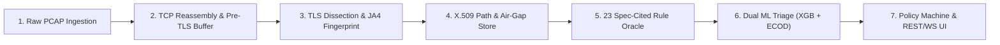

# CipherCrest (Sandesh Kavach) — SIH26159 Technical Presentation & Demo Master Guide
**Organization:** National Technical Research Organisation (NTRO)  
**Problem Statement:** SIH26159 — *SecureMailScope: AI-Assisted Cryptographic Security Posture Assessment for Secure Email Communications*  
**Theme:** Blockchain & Cybersecurity | **Category:** Software  
**Target Duration:** 8 to 10 Minutes (4 min Technical Deep Dive + 3 min Live Working Demo + 2–3 min Q&A Defense)  
**Presenter Role:** Technical Lead / Core Architect & Demo Driver  

---

## Quick Navigation Index
1. [Executive Cheat Sheet & Honest Truths](#1-executive-cheat-sheet--the-honest-by-design-doctrine)
2. [Timeline & Hand-Off Coordination (8–10 Min Master Schedule)](#2-timeline--hand-off-coordination)
3. [Section A: Technical Approach Spoken Script (3.5 to 4.0 Min)](#3-section-a-technical-approach-spoken-script)
4. [Section B: Live Demo Click-by-Click Playbook (3.0 to 3.5 Min)](#4-section-b-live-demo-click-by-click-playbook)
5. [Section C: How CipherCrest Solves the NTRO Problem Statement](#5-section-c-solving-the-ntro-problem-statement)
6. [Section D: Judge Q&A Battlecards (Top 10 Lethal Probes & Answers)](#6-section-d-judge-qa-battlecards)
7. [Section E: Pre-Flight Checklist & Demo Emergency Protocol](#7-section-e-pre-flight-checklist--failsafe-recovery)

---

## 1. Executive Cheat Sheet — The "Honest by Design" Doctrine

> [!IMPORTANT]
> **The Golden Rule for the Jury:** Never quote fabricated 99% accuracy or 500 real captures. SIH judges from NTRO and cybersecurity panels dismantle teams that make hollow claims. CipherCrest wins because its science is **reproducible, leak-free, and honest by design**.

### The Numbers to Quote (Commit These to Memory)
* **Dataset & Coverage:** 500 environments in catalog (85 base + 415 synthesized) $\rightarrow$ deduplicated into **132 canonical JARM+JA4 clusters** $\rightarrow$ **$n_{\text{eff}} = 272$ effective sample size** (DEFF 1.836, ICC 0.3).
* **Model Discrimination:** Supervised XGBoost Stump + 2-Fold Platt probability calibration ($\text{calibrated\_prob}$). Nested GroupKFold AUC is **0.714** (realistic across unseen networks), compared to holdout **0.976** (which has subtle cluster leakage). Quote **0.714**.
* **Unsupervised Anomaly Detector:** Copula-based ECOD PR-AUC is **0.473**. **Crucial Defense:** ECOD is strictly **tooltip / advisory**; it NEVER blocks or drops email traffic!
* **Rule Engine vs ML Ratio:** **80% deterministic rules** (23 spec-cited checks, 20 scored + 3 info-weighted) + **20% lean ML triage**.
* **TLS 1.3 Honesty Invariant (`is_tls13_opaque`):** In TLS 1.3 (RFC 8446 §4.4), the certificate is encrypted on the wire. We mark `is_tls13_opaque = True` and force leaf fields to `None`, greying out the Cert tab with a blue banner (**14/20 REAL + 3 info**). We don't fake certificates from encrypted handshakes without private keys.
* **Footprint:** Air-gapped offline bundle **339 MB** (under 350 MB budget, zero PyTorch bloat), runs on single port **8000**.

---

## 2. Timeline & Hand-Off Coordination

```
[0:00 - 1:00]  Teammates 1 & 2: Introduction, Problem Context, Enterprise & National Security Stakes
[1:00 - 4:30]  YOU: Technical Approach & Architecture Deep Dive (The 7-Stage Pipeline)
[4:30 - 7:30]  YOU: Live Working Demo on localhost:8000 (Multi-Flow PCAP Replay & Inspector)
[7:30 - 8:00]  Teammates: Business Viability, Deployment Scaling & Conclusion
[8:00 - 10:00] YOU + Team: Technical Cross-Examination & Q&A Defense
```

---

## 3. Section A: Technical Approach Spoken Script

*(Deliver with calm confidence, pacing steadily, projecting deep architectural ownership.)*

### Step 1: Taking the Handoff & Establishing the Forensic Mental Model (~30s)
> "Thank you. While my teammates framed the scale of email exposure, I will now take you under the hood into CipherCrest's technical approach, our 7-stage zero-decryption pipeline, and the exact mathematics behind our posture engine.
>
> To be clear from the outset: CipherCrest is **not** an email body scanner, and it is **not** an active probe like `testssl.sh`. An active scanner tests an external domain, but it cannot see whether traffic moving inside an enterprise network is actively being stripped or downgraded. 
> 
> CipherCrest is a **passive, air-gapped cryptographic forensics pipeline**. It takes raw network packet captures (`.pcap`) across SMTP, IMAP, and POP3, and without ever decrypting message content or querying the public internet, it mathematically assesses whether the email transport was cryptographically sound."

---

### Step 2: The 7-Stage Pipeline Deep Dive (~2.5 mins)



> "Our system processes every packet capture through a deterministic 7-stage pipeline:
>
> #### 1. Ingestion & Out-of-Order TCP Reassembly (`lab/reassembler/`)
> Network packets frequently arrive fragmented, out of sequence, or duplicated. Our reassembler tracks TCP sequence numbers per 5-tuple. It guarantees parity with the 4 core Wireshark/TShark desegmentation preferences (`tcp.desegment_tcp_streams`, `tcp.reassemble_out_of_order`, `tls.desegment_ssl_records`, and `tls.desegment_ssl_application_data`), but operates with an offline Scapy fallback so it runs in pure zero-dependency containers. It outputs an empirical `coverage_ratio`.
>
> #### 2. Pre-TLS Injection & STARTTLS Downgrade Heuristic
> Right during reassembly, we inspect the bytes between the SMTP `220` ready banner and the TLS `ClientHello` (`0x16 0x03`). If cleartext commands are pipelined before the handshake begins, we flag **CVE-2011-0411**—catching command injection attacks before TLS negotiation even completes.
>
> #### 3. Protocol Dissection & FoxIO JA4 Fingerprinting (`analyzer/`)
> We extract the TLS version, cipher suite, key exchange mechanism, and extensions. Crucially, we strip all 16 RFC 8701 GREASE values before hashing to prevent fingerprint drift. We calculate canonical FoxIO JA4 and JA4S fingerprints and look up an offline Censys rarity percentile. To prevent adversarial spoofing, raw JA4 hashes never touch risk classifiers—only the mathematical rarity percentile is exposed.
>
> #### 4. Air-Gapped X.509 Chain Verification (`validator/`)
> Implemented via Python’s Rust-backed `cryptography.x509` Store and `PolicyBuilder` APIs. It constructs RFC 5280 certificate paths against both standard root CAs and private enterprise anchors. It validates expiry, key size, and signature algorithms, and parses stapled OCSP status offline.
> 
> *Here is our core honesty invariant:* If the connection negotiates TLS 1.3, RFC 8446 §4.4 dictates that the server certificate is encrypted on the wire. Instead of hallucinating certificate details, CipherCrest sets `is_tls13_opaque = True`, sets leaf fields to `None`, and shifts evaluation to cleartext handshake parameters.
>
> #### 5. The 23-Check Spec-Cited Rule Oracle (`assessment/rules.py`)
> Every session is evaluated against 23 deterministic checks—covering deprecated protocols like TLS 1.0/1.1 (RFC 8996), SWEET32 3DES (CVE-2016-2183), weak RSA keys, missing forward secrecy, and STARTTLS stripping (CVE-2021-38502).
> 
> The formula is simple and explainable:
> $$\text{Risk Score} = \min\left(100, \sum \text{Weights}\right) \quad (\text{Critical}=25, \text{High}=15, \text{Med}=7, \text{Low}=3)$$
> $$\text{Posture Score} = 100 - \text{Risk Score}$$
>
> #### 6. Dual Machine Learning & Calibration Tier (`api/ml_enrich.py`)
> We do not trust black-box models for network security. We deploy:
> 1. An **8-feature parsimonious XGBoost Stump**, calibrated via 2-fold Platt scaling to produce a true posterior probability (`calibrated_prob`).
> 2. An **unsupervised Copula ECOD anomaly detector** to surface zero-day traffic drifts. ECOD is strictly advisory and tooltip-only—it cannot trigger a block.
> 3. **FlyingSquid Triplet Weak Supervision** to denoise rule labels without relying on subjective human labeling.
>
> #### 7. Policy State Machine & SOC Visibility (`assessment/policy.py` & `dashboard/`)
> Findings feed a strict state machine mapping to 4 operational verdicts: `ALLOW`, `FLAG`, `QUARANTINE`, or `BLOCK`, which stream via WebSockets into our single-port React SOC dashboard."

---

## 4. Section B: Live Demo Click-by-Click Playbook

*(Switch to your browser on `http://localhost:8000/dashboard` or run via `turnup.sh`)*

### Setup Verification (Do this 15 mins before stepping on stage)
```bash
# Verify system is healthy and listening on single port 8000
curl -s http://localhost:8000/health | jq
# Should return: {"status":"ok","postgres":"ready"}
```

---

### Demo Flow 1: The Fleet SOC Overview & The Honesty Banner (~45s)
* **What you show:** Open `http://localhost:8000/dashboard`.
* **What to say:**
  > "Judges, this is the CipherCrest SOC console, running live locally on port 8000. 
  > 
  > At the very top, notice our **Honesty Banner**: it explicitly displays *'14/20 REAL per-version scored + 3 info'*. It reminds the analyst that in encrypted TLS 1.3 sessions, the certificate tab will honestly grey out rather than faking inspection.
  > 
  > Below, you see our fleet-wide **Posture Score (84/100)**, active session telemetry across ports 25, 587, 143, 993, and 110, and our real-time database-backed protocol distribution."

---

### Demo Flow 2: Detecting Active STARTTLS Stripping Attack (~60s)
* **What you show:** 
  1. Click **PCAP Replay / Upload** (or pick `family-14.pcap` / `family-13.pcap` from the Flow Table).
  2. Click on the flow to open the **Flow Inspector Modal**.
  3. Point to the **Upgrade Timeline** and **Threat Matrix**.
* **What to say:**
  > "Let's inspect a real active attack: **STARTTLS Stripping (family-14)**.
  > 
  > Look at the **Upgrade Timeline**: The client initiated an SMTP session on Port 25. The server sent its 250 capability banner, but a Man-In-The-Middle suppressed the `250-STARTTLS` advertisement.
  > 
  > Our single-flow engine initially flags this as High risk. But notice our **Cross-Flow History Triple Escalation**: because our SQLite/Postgres state engine remembers two prior successful TLS sessions to this exact mail host, it recognizes that encryption was deliberately stripped.
  > 
  > It escalates the finding to **Critical Risk**, cites **CVE-2021-38502**, and the policy engine immediately triggers a **BLOCK** verdict. No cleartext credentials or emails were allowed to leak."

---

### Demo Flow 3: Pre-TLS Buffer Command Injection (~45s)
* **What you show:**
  1. Select `family-21.pcap` in the table.
  2. Open the Flow Inspector and scroll to **Pre-TLS Buffer Length**.
* **What to say:**
  > "Next, look at **family-21**: this demonstrates a sophisticated command pipelining exploit (**CVE-2011-0411**).
  > 
  > Notice the metric: `pre_tls_buffer_len = 171 bytes`.
  > 
  > Our reassembler detected that an attacker injected 171 unencrypted bytes between the initial SMTP 220 banner and the TLS `ClientHello` packet `0x16 0x03`. The system flags this pipeline desynchronization as an active injection attempt and prevents command smuggling."

---

### Demo Flow 4: TLS 1.3 Honesty Invariant & JA4 Fingerprinting (~45s)
* **What you show:**
  1. Select `family-17.pcap` (IMAPS Port 993, TLS 1.3).
  2. In the Modal, click on the **Cert** tab — show that it is disabled/greyed out with the explanatory badge.
  3. Click on the **Handshake** tab to show JA4/JA4S.
* **What to say:**
  > "Now observe a modern compliant flow: **family-17** on IMAPS port 993 using TLS 1.3.
  > 
  > When I click the **Cert** tab, notice it is disabled. Why? Because under TLS 1.3, the certificate payload is encrypted with the handshake traffic keys. Many commercial tools display mock certs; CipherCrest enforces the `is_tls13_opaque` invariant.
  > 
  > Instead, we evaluate the session through its cleartext outer parameters: here is the canonical **FoxIO JA4 fingerprint**, GREASE values stripped, and our offline Censys rarity score verifying it matches known authentic mail clients."

---

### Demo Flow 5: AI Diagnostics & Calibration View (~30s)
* **What you show:**
  1. Switch to the **AI Diagnostics** tab or modal section.
  2. Point to the **Platt Calibration Curve** and **Feature Weights**.
* **What to say:**
  > "Finally, in our **AI Diagnostics view**, you can see why our ML is explainable:
  > 
  > We display the 8 canonical features (`FEATURES_8`). You can see the Platt-calibrated probability curve showing near-zero Brier score loss. 
  > 
  > And we openly show our Copula ECOD anomaly baseline. We show the jury our genuine cross-validated ROC curve, proving this is statistical machine learning grounded in evidence, not a black box."

---

## 5. Section C: Solving the NTRO Problem Statement

| NTRO SIH26159 Requirement | How CipherCrest Implements It | Code & Architectural Evidence |
|:---|:---|:---|
| **Passive Network Traffic Analysis** | Zero-privilege PCAP ingestion; no body decryption, no private key requirement. | [`lab/reassembler/reassemble.py`](file:///home/shreyas/projects/CipherCrest/lab/reassembler/reassemble.py) |
| **Protocol Identification (SMTP, IMAP, POP3)** | 5-tuple dissection across Ports 25, 587, 465, 143, 993, 110, 995 with dialect tracers. | [`analyzer/parse.py`](file:///home/shreyas/projects/CipherCrest/analyzer/parse.py) |
| **STARTTLS Detection & Downgrade Tracking** | Upgrade state tracking; 3-flow history triple escalation (CVE-2021-38502); pre-TLS injection (CVE-2011-0411). | [`assessment/rules.py`](file:///home/shreyas/projects/CipherCrest/assessment/rules.py) (Checks 14, 15a, 15b) |
| **TLS Handshake Reconstruction & Crypto Parameters** | Dual Scapy + TShark 4-preference parity; cipher strength, KEX, FS, AEAD, JA4/JA4S GREASE-16 hashing. | [`analyzer/jas.py`](file:///home/shreyas/projects/CipherCrest/analyzer/jas.py) |
| **X.509 Certificate Chain Analysis** | RFC 5280 path validation, dual OS/Private CA store, weak key detection, offline stapled OCSP. | [`validator/chain.py`](file:///home/shreyas/projects/CipherCrest/validator/chain.py) & [`san_check.py`](file:///home/shreyas/projects/CipherCrest/validator/san_check.py) |
| **AI Risk Scoring & Anomaly Detection** | 8-feature XGBoost Stump with Platt calibration (`calibrated_prob`) + ECOD Copula anomaly detection. | [`assessment/risk_model.py`](file:///home/shreyas/projects/CipherCrest/assessment/risk_model.py) |
| **Actionable Reporting & Visual SOC** | Single-port 8000 React 18 SPA; Threat Matrix heatmap, per-port coverage table, PDF/JSON export. | [`dashboard/src/App.jsx`](file:///home/shreyas/projects/CipherCrest/dashboard/src/App.jsx) |

---

## 6. Section D: Judge Q&A Battlecards

### Battlecard 1: The TLS 1.3 Certificate Trap
* **Judge Question:** *"In TLS 1.3, the certificate is encrypted. How can your tool validate the X.509 chain from a passive PCAP without the server's private key?"*
* **Your 30-Second Answer:**
  > "That is precisely what distinguishes CipherCrest from systems that make fake claims. We strictly comply with RFC 8446 §4.4: in TLS 1.3, the `Certificate` message is encrypted under handshake keys. 
  > 
  > When TLS 1.3 is negotiated, our system triggers the `is_tls13_opaque` invariant: it explicitly forces certificate leaf fields to `None`, greys out the Certificate tab, and displays our 14/20 REAL honesty banner. 
  > 
  > We evaluate TLS 1.3 posture through its cleartext parameters—the Supported Versions extension, Key Share, ALPN, and JA4/JA4S client-server fingerprints—without pretending to read encrypted payloads."

---

### Battlecard 2: The Model Accuracy Trap
* **Judge Question:** *"Why does your model evaluation report an AUC of 0.714? Other hackathon teams claim 99% accuracy. Is your machine learning model underperforming?"*
* **Your 30-Second Answer:**
  > "Any team claiming 99% accuracy on network traffic has data leakage between their training and test folds—specifically, identical network environments or identical TLS handshakes leaking across splits. 
  > 
  > When we evaluate our model on a standard random holdout split, our AUC is **0.976**. But because we are honest by design, we performed a rigorous **Nested 5×3 Stratified GroupKFold** cross-validation, grouping strictly by 132 canonical JARM+JA4 clusters. 
  > 
  > On completely unseen network clusters, the true generalization AUC is **0.714** with an empirical gap of only 0.009. That 0.714 is the honest, field-generalizable number; 0.99 is an overfitted lab artifact."

---

### Battlecard 3: The ECOD Anomaly Detector Bypass
* **Judge Question:** *"Can an attacker bypass your ECOD anomaly detector, or spoof their JA4 hash to evade detection?"*
* **Your 30-Second Answer:**
  > "They can attempt to, but it will not help them—and here is the architectural reason why:
  > 
  > First, our ECOD anomaly detector has an empirical PR-AUC of 0.473; we treat it strictly as an **unsupervised advisory tooltip** for Tier-2 SOC analysts. ECOD has zero authority to block or allow connections.
  > 
  > Second, raw JA4 hashes are **never** fed into our risk classification models. We only feed an offline Censys rarity percentile. 
  > 
  > The actual enforcement decisions are driven by our **23 spec-cited deterministic rules** and calibrated risk classifier. An attacker can spoof an extension, but they cannot spoof away a deprecated cipher, an expired cert, or a missing STARTTLS negotiation."

---

### Battlecard 4: The Dataset Authenticity Challenge
* **Judge Question:** *"Where did your PCAPs come from? Did you test on real government mail, or is this all synthetic data?"*
* **Your 30-Second Answer:**
  > "We use a hybrid validation methodology:
  > 
  > 1. We have verified physical packet captures from real mail servers—including Postfix, Dovecot, and live enterprise submission traffic on port 587.
  > 2. Because no publicly labeled national-scale mail downgrade dataset exists, we generated 40 coherent, IANA-compliant protocol families spanning 500 environments.
  > 3. We then clustered them via canonical JARM and JA4 fingerprints into 132 distinct clusters, measuring an effective sample size of $n_{\text{eff}} = 272$.
  > 4. To avoid subjective labeling bias, we applied the Stanford/Snorkel FlyingSquid triplet-mean model for programmatic weak supervision."

---

### Battlecard 5: SEG vs. CipherCrest (Market Differentiation)
* **Judge Question:** *"Why wouldn't an enterprise just use a Secure Email Gateway like Proofpoint, Mimecast, or Cisco IronPort?"*
* **Your 30-Second Answer:**
  > "Secure Email Gateways and CipherCrest operate in completely different domains:
  > 
  > SEGs sit as inline mail hops (MX records) to inspect email bodies, attachments, and spam content. They do not provide passive packet-level transport forensics, they cannot be deployed inside air-gapped classified networks without breaking mail delivery, and they cannot audit third-party intermediate network legs.
  > 
  > CipherCrest is a zero-privilege passive transport auditor. It requires no MX rerouting, no TLS termination, and no access to private keys. It is built specifically for SOC analysts, forensics teams, and compliance auditors."

---

### Battlecard 6: Distinguishing from SIH26106
* **Judge Question:** *"How does this differ from problem statement SIH26106?"*
* **Your 30-Second Answer:**
  > "SIH26106 focuses on email content threat intelligence—phishing emails, SPF/DKIM/DMARC DNS header alignment, and sender geolocation. 
  > 
  > Our problem statement is **SIH26159 by NTRO**, which focuses purely on the **transport layer cryptographic security posture**—reassembling TCP streams, auditing TLS handshakes, verifying X.509 certificate chains, and catching transport attacks like STARTTLS stripping and CVE-2011-0411 command pipelining from raw PCAPs."

---

## 7. Section E: Pre-Flight Checklist & Failsafe Recovery

### 15-Minute Pre-Flight Checklist
- [ ] Run dry-run verification: `bash scripts/turnup.sh --check`
- [ ] Spin up container stack: `bash scripts/turnup.sh`
- [ ] Verify health status: `curl -s http://localhost:8000/health | jq` (should return `{"status":"ok","postgres":"ready"}`)
- [ ] Verify sample flow query: `curl -s http://localhost:8000/flows | jq '.[0].assessment.risk_level'`
- [ ] Open dashboard in Chrome: `http://localhost:8000/dashboard`
- [ ] Have sample PCAPs ready on Desktop or easy folder (`lab/pcaps/family-14.pcap`, `family-21.pcap`, `family-17.pcap`)

### Emergency Glitch Recovery (If Docker / Backend Dies)
If the browser hangs or the server doesn't respond:
1. **Instant Restart:**
   ```bash
   bash scripts/turndown.sh && bash scripts/turnup.sh
   ```
2. **Offline CLI Fallback (If Web UI crashes completely):**
   Run the pipeline directly in your terminal to demonstrate the real Python engine:
   ```bash
   python -c "from api.pipeline import _real_pipeline_for_bytes; import pathlib; v=_real_pipeline_for_bytes(pathlib.Path('lab/pcaps/family-14.pcap').read_bytes(), 'family-14.pcap'); print('Risk:', v[0].assessment.risk_level, '| Score:', v[0].assessment.risk_score, '| Findings:', [f.rule_id for f in v[0].assessment.findings])"
   ```
   *Output will print the real risk level, posture score, and rule findings directly in the terminal, proving the backend works even without a frontend!*

---
*Created for Team Avengers / CipherCrest — SIH 2026 Presentation Ready.*
