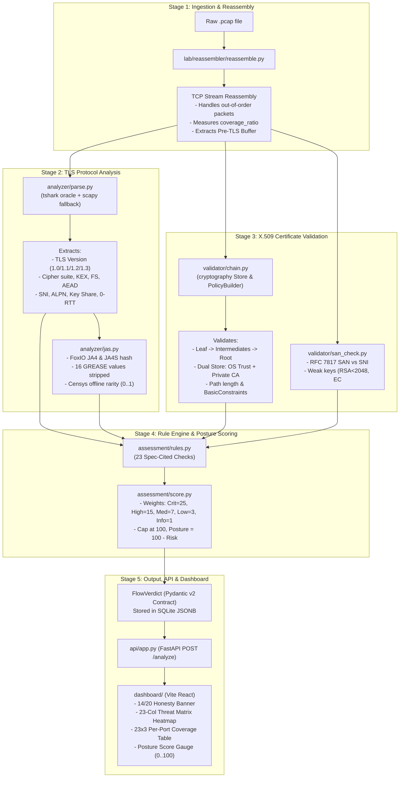

# SecureMailScope — Architecture, Implementation & Developer Guide (Day 4)

**Project:** SecureMailScope (SIH26159 — NTRO Cybersecurity)  
**Theme:** AI-Assisted Cryptographic Security Posture for Secure Email (SMTP / IMAP / POP3 + STARTTLS + TLS 1.2/1.3 + X.509)  
**Current Milestone:** **Day 4 Completed — Real Deterministic Pipeline Fully Integrated & Verified**

---

## 1. The Core Concept in Simple English

Traditional email scanners either look only at email headers (`Received:` headers, which are lossy and easily spoofed) or test external servers actively (like SSL Labs / testssl.sh, which can't see traffic as it flies across an enterprise network).

**SecureMailScope** is a **passive, zero-privilege cryptographic forensic pipeline**. It inspects raw network packet captures (`.pcap`) or live traffic streams, reconstructs the email network flows, and cryptographically evaluates the health, cipher strength, certificate chain, and security posture of email traffic without ever decrypting email message bodies or making live internet lookups.

---

## 2. High-Level Developer Mental Model

When a PCAP is uploaded to the system, it passes through 5 distinct pipeline stages:



---

## 3. Detailed Component Breakdown (Implemented up to Day 4)

### Stage 1: Lab & Stream Reassembly (`lab/reassembler/`)
* **Goal:** Turn raw IP/TCP packets into coherent client/server application byte streams.
* **How it works:**
  1. Identifies 5-tuples (`src_ip, src_port, dst_ip, dst_port, protocol`).
  2. Tracks TCP sequence numbers and reassembles segments, even when packets arrive out-of-order or duplicate.
  3. Calculates `reassembly_coverage_ratio = reassembled_bytes / total_bytes`. Clean traffic gives `1.0`; lossy/jittered traffic produces honest `< 1.0` (e.g. `0.897`), proving packet loss tracking works.
  4. **Pre-TLS Buffer Heuristic (`_compute_pre_tls_buffer`):** Scans bytes between the SMTP `220` ready banner and the TLS ClientHello (`0x16 0x03`). If extra unencrypted data is pipelined before the TLS handshake begins, it flags possible SMTP command injection (**CVE-2011-0411** / GHSA-9j88).

### Stage 2: TLS Handshake Parsing & Fingerprinting (`analyzer/`)
* **Goal:** Extract exact cryptographic parameters from the handshake without breaking on TLS 1.3 encrypted data.
* **How it works:**
  * **Dual-Path Parser (`analyzer/parse.py`):** Uses `tshark -T json` with 4 mandatory desegmentation preferences as the primary byte-identical oracle, falling back to `scapy.layers.tls` and direct binary struct parsing.
  * **Version Detection:** Resolves legacy version `0x0303` + `supported_versions` (`0x002b` with `0x0304`) $\rightarrow$ `TLS 1.3`, else `TLS 1.2` / `1.1` / `1.0`.
  * **Cryptographic Classification:** Identifies Key Exchange (`ECDHE`, `DHE`, `RSA`), Forward Secrecy (`fs_flag = True` if ECDHE/DHE or TLS 1.3), AEAD status (Mozilla Intermediate list), and cipher strength (`weak` if RC4/DES/3DES/NULL/EXPORT).
  * **TLS 1.3 Encrypted Cert Handling:** Because TLS 1.3 encrypts the Certificate handshake message, the parser marks `cert.is_tls13_opaque = True`.
  * **JA4 Fingerprinting (`analyzer/jas.py`):** Computes canonical FoxIO `ja4` and `ja4s` hashes. Filters out all 16 RFC 8701 GREASE values (`0x0A0A`..`0xFAFA`) to eliminate hash drift.
  * **Offline Rarity:** Looks up prevalence in [`shared/data/censys_top_ja4.json`](file:///home/shreyas/projects/CipherCrest/shared/data/censys_top_ja4.json) to compute `ja4_rarity = 1 - percentile` (0.0 to 1.0). **Security Invariant:** Raw `ja4` hash is never fed into ML risk models (to prevent spoofing); only numeric `ja4_rarity` is exposed.

### Stage 3: X.509 Certificate Validation (`validator/`)
* **Goal:** Complete RFC 5280 §6 certificate path construction and cryptographic validation under a strict air-gap.
* **How it works:**
  * **Rust-Backed Dual-Store (`validator/chain.py`):** Uses `cryptography.x509.verification.Store` and `PolicyBuilder` (modern 2024 API, no deprecated `verify_directly`). Anchors to both OS trust roots (`/etc/ssl/certs/ca-certificates.crt`) and private lab CA (`validator/stores/privateCA.pem`).
  * **Chain Integrity:** Validates Leaf $\rightarrow$ Intermediate $\rightarrow$ Root signatures, checks `BasicConstraints CA:TRUE/FALSE`, path length limits, and key usage.
  * **SAN & Hostname Verification (`validator/san_check.py`):** Matches RFC 7817 `dNSName` SAN against the target hostname (or SNI). CN fallback is flagged as Medium risk.
  * **Weak Parameter Detection:** Detects RSA $<2048$ (or $<1024$ Critical), EC $<P\text{-}256$, weak signature algorithms (SHA-1, MD5), expired certificates, and not-yet-valid certificates.
  * **Stapled OCSP Parser:** Parses `CertificateStatus` (type 22) handshake payloads offline using `cryptography.x509.ocsp.load_der_ocsp_response`. Returns `good`, `revoked`, `unknown`, `not-stapled`, or `opaque` (for TLS 1.3). **No live OCSP/CRL network queries are performed.**

### Stage 4: 23-Check Assessment & Posture Scoring (`assessment/`)
* **Goal:** Convert cryptographic findings into spec-cited security risks and an overall posture gauge.
* **The 23 Rule Checks (`assessment/rules.py`):**
  1. `TLS version deprecated` (RFC 8996) — Critical for TLS 1.0/1.1
  2. `TLS version outdated` (NIST SP 800-52r2) — Medium for TLS 1.2
  3. `Weak cipher` (RFC 7465) — Critical for RC4 / NULL / EXPORT
  4. `3DES SWEET32` (NIST 800-67 / CVE-2016-2183) — High for DES-CBC3
  5. `CBC without AEAD` (RFC 5116) — Medium/High
  6. `Weak KEX` (NIST 800-52r2) — High for RSA key exchange (no Forward Secrecy)
  7. `Weak pubkey` (NIST 800-57) — High for RSA $<2048$, Critical for $<1024$
  8. `Weak sigalg` (RFC 9155 / CABF BR) — High for SHA-1 / MD5
  9. `Certificate expired` (RFC 5280 §6.1.3) — Critical
  10. `Certificate not yet valid` (RFC 5280) — High
  11. `Chain incomplete / self-signed` (RFC 5280 §6) — High (Medium if private CA)
  12. `Hostname mismatch` (RFC 7817 / RFC 6125) — High
  13. `No forward secrecy` (RFC 8446) — High
  14. `STARTTLS not offered` (RFC 3207 / M3AAWG) — High
  15. `15a. STARTTLS stripping suspected` (CVE-2021-38502 EAST 320k) — Critical if $\ge 3$ flow history on same 5-tuple, else High (low-conf)
  16. `15b. Pre-TLS injection possible` (Postfix CVE-2011-0411) — High if pipelined buffer $>0$, else Info (1pt)
  17. `16. Implicit TLS absent` (RFC 8314) — Info
  18. `16b. MX / MTA-STS / DANE` (RFC 8461 / RFC 7672) — Info (1pt enforce lane)
  19. `16c. 0-RTT Early Data / ECH` (RFC 8446 §8 / RFC 9846 / RFC 9849) — Medium if replayable, else Info
  20. `17. Certificate expiry < 30d` (CABF BR) — Medium
  21. `18. KeyUsage missing` (RFC 5280) — High / Info
  22. `19. ExtendedKeyUsage not serverAuth` (RFC 5280) — High / Info
  23. `20. pathLen violation` (RFC 5280) — High / Info
* **Deterministic Posture Scoring Formula (`assessment/score.py`):**
  $$\text{Risk Score} = \min\left(100, \sum \text{Weights}\right) \quad \text{where } \text{Crit}=25, \text{High}=15, \text{Med}=7, \text{Low}=3, \text{Info}=1$$
  $$\text{Risk Level} = \begin{cases} \text{Critical} & \text{if } \text{Risk Score} \ge 40 \\ \text{High} & \text{if } \text{Risk Score} \ge 25 \\ \text{Medium} & \text{if } \text{Risk Score} \ge 10 \\ \text{Low} & \text{otherwise} \end{cases}$$
  $$\text{Posture Score} = 100 - \text{Risk Score}$$

### Stage 5: API, SQLite & React Dashboard (`api/`, `dashboard/`)
* **FastAPI Server (`api/app.py`):**
  * `POST /analyze`: Accepts multipart `.pcap` or `.zip` of PCAPs. Automatically runs the real pipeline when `USE_STUB=False`.
  * `GET /flows`: Queries analyzed verdicts from SQLite JSONB (`api/db.py`).
  * `GET /report`: Generates structured compliance and forensic summaries.
* **React Vite Dashboard (`dashboard/`):**
  * **14/20 Honesty Banner:** If TLS 1.3 opaque certs are present, shows a blue honesty banner explaining that transport is 1.3 encrypted (14/20 checks real, cert tab greyed out).
  * **23-Column Threat Matrix:** Visual heatmap showing all 20 scored columns in color and 3 info-weighted columns in grey.
  * **Per-Port 23×3 Coverage Table:** Compares ports 25, 587, and 993 against RFC 8314, M3AAWG, MTA-STS, and DANE.
  * **Bundle Optimization:** Gzipped production assets are ~156 KB (well within the 3.5 MB budget).

---

## 4. What Is Working Right Now (Demonstration & CLI Commands)

You can run and test every component right now:

### 1. Run the Full Core Test Suite (91 Tests)
```bash
PYTHONPATH=. pytest shared/tests/test_schema.py \
  lab/reassembler/tests/test_reassembly.py \
  lab/reassembler/tests/test_coverage_ratio.py \
  lab/reassembler/tests/test_history_triple.py \
  analyzer/tests/test_handshake.py \
  analyzer/tests/test_ja4.py \
  shared/tests/test_ja4_grease.py \
  shared/tests/test_ja4_rarity.py \
  validator/tests/test_chain_limbo.py \
  validator/tests/test_badssl.py \
  assessment/tests/test_rules.py \
  api/tests/test_api.py -v
```
*Expected Result:* **91 passed, 1 skipped, 0 failed**.

### 2. Analyze a Real PCAP from the Command Line
```bash
# Parse TLS Handshake
PYTHONPATH=. python -m analyzer.parse lab/pcaps/family-01.pcap --json

# Calculate JA4 & Offline Censys Rarity
PYTHONPATH=. python -m analyzer.jas lab/pcaps/family-01.pcap --json

# Validate X.509 Certificate Chain via Rust Store/PolicyBuilder
PYTHONPATH=. python -m validator.chain lab/certs/rsa2048.crt --json

# Full End-to-End Reassembly & Injection Detection
PYTHONPATH=. python -m lab.reassembler.reassemble lab/pcaps/family-01.pcap --json
```

### 3. Start the API Server & Dashboard
```bash
# Start FastAPI backend (serves API + React dashboard at http://localhost:8000)
python -m uvicorn api.app:app --host 0.0.0.0 --port 8000
```
Then upload any PCAP:
```bash
curl -X POST -F "file=@lab/pcaps/family-01.pcap" http://localhost:8000/analyze | jq .
```

---

## 5. How Day 4 Connects to the Final 10-Day Project

The complete project vision spans 10 days across two product tiers:
1. **Workbench / Scanner Tier (Core Graded):** Passive forensic analysis of PCAPs / traffic recordings with 100% deterministic rules, ML anomaly detection, and posture scoring.
2. **Gateway / Appliance Tier (Stretch Demo):** Inline Postfix milter (`127.0.0.1:10025`) enforcing real-time policy decisions before email queuing.

```mermaid
graph LR
    subgraph D1_D4["Days 1-4 (COMPLETED ✅)"]
        D1["Monorepo & Schemas"] --> D2["10 Lab Families & Reassembly"]
        D2 --> D3["TLS Parser & JA4 GREASE"]
        D3 --> D4["X.509 Store/PolicyBuilder & 23 Rules"]
    end

    subgraph D5_D6["Days 5-6 (NEXT MILESTONE)"]
        D4 --> D5["Policy Engine\n(pass / tag / quarantine / reject)"]
        D5 --> D6["MTA-STS & DANE MockDNS Bridge\nARF & SIEM Log Exporter"]
    end

    subgraph D7_D8["Days 7-8 (ML POSTURE)"]
        D6 --> D7["XGBoost Risk Classifier\nECOD Anomaly Detector"]
        D7 --> D8["Platt Probability Calibration\nSHAP Feature Attribution"]
    end

    subgraph D9_D10["Days 9-10 (PACKAGING & DEMO)"]
        D8 --> D9["Offline Wheelhouse Bundle (<350MB)\nDocker Compose Appliance"]
        D9 --> D10["Blind Likert Evaluation\nInline Milter Demo"]
    end
```



### Next Steps to Implement (Days 5 to 10):
* **Days 5–6:** Implement `assessment/policy.py` to convert `Assessment` into `PolicyDecision` (handling quarantining and alert generation), bridge live DNS queries to MTA-STS/DANE, and export ARF incident reports.
* **Days 7–8:** Add the ML classification layer (XGBoost + ECOD) using `ja4_rarity` and TLS metadata (strictly avoiding raw `ja4` strings and avoiding isotonic calibration on small samples).
* **Days 9–10:** Build the offline wheelhouse bundle and finalize evaluation benchmarks against baseline tools.

---

## 6. Architectural Guarantees & Invariants Summary

| Guarantee | Why it exists | How it is enforced in code |
|---|---|---|
| **Air-Gap Integrity** | Evaluation must work in air-gapped forensic environments without internet. | `censys_top_ja4.json` used offline; stapled OCSP parsed directly; no live socket calls to OCSP responders or CRL endpoints. |
| **TLS 1.3 Honesty Invariant** | In TLS 1.3, certificates are encrypted on the wire. Faking cert fields is dishonest. | `shared/schemas.py` enforces via Pydantic `model_validator` that if `is_tls13_opaque=True`, `leaf_present=False` and all cert attributes must be `None`. |
| **GREASE Harmonization** | RFC 8701 GREASE values randomize client hellos and break fingerprint matching. | `shared/ja4_rarity.py` strips all 16 values (`0x0A0A`..`0xFAFA`) before generating JA4 hashes. |
| **No Raw JA4 in ML Vector** | Attackers can forge raw JA4 strings using tools like `curl-cffi`. | `ALLOWED_RISK_FEATURES` whitelists numeric `ja4_rarity` while explicitly forbidding raw `ja4` from feature vectors. |
| **Rust-Backed Path Validation** | Custom regex or deprecated OpenSSL bindings cause security bypasses. | `validator/chain.py` uses `cryptography.x509.verification.Store` & `PolicyBuilder`. |
