# CipherCrest — Evidence Map (Phase 1 Hostile Audit)

> Generated 2026-08-27 · `PYTHONHASHSEED=0` · Audit per `ciphercrest-ml-auditor` Phase 1 / `.omo/plans/ciphercrest-hostile-audit.md` T03
> Verbatim: `Labels are rule-derived weak supervision (score.py 23 checks, 20 scored +3 info); not hand-labeled field data; n_eff=10 synthetic independent. See Dataset Charter §1/§4a.`
> Operational override: `n_eff=500 p_n 0.01 TOP5 / 0.014 TOP7 @500` (quality target, honest working `n≈200`), `legal n_eff=10` preserved.

## Artifact Table

| Artifact | Path (exact) | What it proves | Line / Key | Status |
|---|---|---|---|---|
| **Docs — architecture** | `docs/ARCHITECTURE_AND_STATUS_DAY4.md` | Day 4 pipeline integration status | `docs/` | exists |
| **Docs — comprehensive ML** | `docs/CipherCrest_Comprehensive_ML_Architecture_and_Evaluation.pdf` (169K) | Full ML arch + evaluation | `docs/` | exists |
| **Docs — family taxonomy** | `docs/FAMILY_TAXONOMY.md` | 50-family honest + 415 synth distinct taxonomy | `docs/` | exists |
| **Docs — large files** | `docs/LARGE_FILES.md` | LFS vs Releases vs wheelhouse 345M decision (<5M keep pkls in git) | §5 | exists |
| **Docs — ML arch eval** | `docs/ML_ARCHITECTURE_AND_EVALUATION.md` | ML metrics annex | `docs/` | exists |
| **Docs — tshark** | `docs/TSHARK.md` | 4 prefs offline scapy primary vs tshark oracle parity | `tcp.desegment_tcp_streams` etc. | exists |
| **Manifest** | `lab/manifest.json` (9632 lines, 535 keys, 365K) | 500 envs: `family-01..50` + `family-51..500` synth via `lab/scripts/synth_families.py --seed 0`, `environment_id family-XX__synth_random_seedN`, 5-tuple pcap, IANA GREASE 16 filtered ground truth | `family-01.cipher`, `environment_id`, `docker_image_sha256`, `source_id` | exists |
| **Manifest hash** | `lab/manifest.sha256` | Integrity of manifest | sha256 | exists |
| **PCAPs — base** | `lab/pcaps/family-01.pcap` … `family-50.pcap` (51 files, ~1K each) | Base families real SMTP STARTTLS Bennett per `patrickmccanna.net/32` | `lab/pcaps/family-{01..50}.pcap` | exists |
| **PCAPs — jitter** | `lab/pcaps/jittered/` + `lab/pcaps/family-0{2,3,4,5,7}-jitter-*.bin` via `lab/reassembler` | 35 jitter slices GREASE `0x0a0a` expiry ±5d | jitter slices | exists (35) |
| **Reassembled** | `lab/reassembled/*.bin` (85 × 120B) | TCP reassembled with 4 prefs `tcp.desegment_tcp_streams, tcp.reassemble_out_of_order, tls.desegment_ssl_records, tls.desegment_ssl_application_data` | `lab/reassembler/README.md` 4-prefs | exists (85) |
| **Lab ledger** | `lab/LEDGER.md` (136K) | Per-family `pcap sha256 STARTTLS Cipher (+GREASE sha384) Cert tshark parity PASS coverage_ratio 1.0` | per-row ledger | exists |
| **Analyzer — parse** | `analyzer/parse.py` | Cipher vs manifest GREASE 16 exact IANA | `analyzer/jas.py` + `parse.py` | exists |
| **Validator — chain** | `validator/` `cryptography` Store/PolicyBuilder | Stratified CABF/private X.509 validation, `prec 1.000` | `validator/` | exists |
| **Rule engine truth** | `assessment/rules.py` (201 LOC) | 23 checks `20 scored +3 info-greyed`, finding `check/severity/spec/evidence/remediation` | `assessment/rules.py:1` `23 checks per §4 D.2`, `evaluate()` L21, `score()` `assessment/score.py:58` | exists |
| **Score** | `assessment/score.py` (80 LOC) | Risk scoring 23→`risk_score/risk_level` deterministic y, WEAK SUPERVISION source | `score.py:50 _risk_level`, `score():58` | exists |
| **WEAK SUPERVISION (legal)** | `assessment/risk_dataset.py:17` | `WEAK_SUPERVISION = "Labels are rule-derived weak supervision (score.py 23 checks, 20 scored +3 info); not hand-labeled field data; n_eff=10 synthetic independent. See Dataset Charter §1/§4a."` | `risk_dataset.py:17` | exists |
| **WEAK SUPERVISION (model)** | `assessment/risk_model.py:3` | Same verbatim header + `p/n 0.5 n_eff 10 Platt unpowered at n_cal<20` caveat | `risk_model.py:3`, `risk_model.py:21` comment | exists |
| **WEAK SUPERVISION (splits)** | `assessment/splits.json:4088` | `WEAK_SUPERVISION_VERBATIM` + `WEAK SUPERVISION` + `WEAK_SUPERVISION_OPERATIONAL` (n_eff 500 `p_n 0.01` disclosure) | `splits.json:4088-4090` | exists |
| **WEAK SUPERVISION (guard)** | `shared/schemas_eval.py` | `WEAK_SUPERVISION_VERBATIM` hard-fail gate | `schemas_eval.py:WEAK_SUPERVISION_VERBATIM` | exists |
| **Features 28** | `assessment/features.py:91` | `FEATURES_28 = _BASE_21 + _MISS_7` len 28 (21 base +7 miss indicators), whitelist `ALLOWED_RISK_FEATURES` mirror `shared/ja4_rarity`, `raw ja4` forbidden | `features.py:28-31 assert "ja4" not in ALLOWED_RISK_FEATURES`, `features.py:91 FEATURES_28`, `features.py:95 assert len==28`, `features.py:105` categorical guard | exists |
| **FEATURES TOP5** | `assessment/features.py:119-123` | `FEATURES_TOP5` 5 cols `version, cipher_strength, kex, chain_valid, days_to_expiry`, `p_n_ratio = 5/500 =0.01` honest @500, `5/50=0.10` @50, guard `<=0.14` | `features.py:119 _FEATURES_TOP5_RAW`, `features.py:122 p_n_ratio 0.01`, `features.py:133 assert abs(p_n_ratio-0.01)` | exists |
| **FEATURES TOP7** | `assessment/features.py:140-147` | TOP5 + miss indicators `chain_valid + days_to_expiry` =7 cols, `p_n 0.014 @500` (7/500), `0.14 @50` guard | `features.py:140 _FEATURES_TOP7_RAW`, `features.py:146 p_n_ratio_top7 0.014`, `features.py:157 assert 0.014` | exists |
| **build_vector** | `assessment/features.py:169` | `build_vector(flow, mode="xgb"|"ae") -> list[float] len 28 FEATURES_28 order NaN-free`, `build_vector_top5/top7` via slice | `features.py:169 def build_vector`, `features.py:254 build_vector_top5`, `features.py:277 build_vector_top7` | exists |
| **XGB guard** | `assessment/features.py:XGB_CATEGORICAL_PARAMS` | `tree_method hist device cpu enable_categorical True max_depth 4 n_estimators 80 reg_alpha 1.0 reg_lambda 2.0 max_cat_threshold 8` | `features.py: ~XGB_CATEGORICAL_PARAMS` | exists |
| **Weak supervision LF** | `assessment/weak_supervision.py` | FlyingSquid `m=6 triplet_mean O(nm)` `E[LaLb]=(2αa-1)(2αb-1)`, 6 LFs `lf_tls_deprecated lf_weak_cipher lf_weak_kex lf_chain_invalid lf_days_lt30 lf_san_or_ja4_high (>0.9 ja4_rarity)` Cardinality 2, limited to critical metrics not primary y | `weak_supervision.py:360 LFS`, `weak_supervision.py:274 lf_weak_cipher` | exists |
| **Training** | `assessment/risk_model.py` + `assessment/risk_train.py` + `assessment/risk_dataset.py` + `assessment/risk_metrics.py` | XGB stump `max_depth 2 n_estimators 80` (hist stump honest), `CalibratedClassifierCV(method sigmoid cv2)` Platt only, `LeaveOneGroupOut` / `StratifiedGroupKFold` grouping `environment_id` / `canonical_cluster_id 132`, `bootstrap 2000`, ECE bins `max(2,n_val//5)` gated min>=12 else 3 | `risk_dataset.py:9 FEATURES_28`, `risk_model.py:XGB_PARAMS max_depth 2`, `risk_train.py:53-79` | exists |
| **Splits** | `assessment/splits.json` (104K) | 500 envs `family-01…50 +51-500` synth via `hash(TLS,cipher,kex)` partition, `D1_train_groups 150 (30/bin quality at 500)`, `D2_val_groups 100`, `D3_locked_groups 30`, `spare_groups 220`, `D_prior_groups 50` disjoint via TLS hash not env string, `groups_by_family 500 distinct`, `canonical_n_groups 132`, `n_eff 500 p_n 0.01 p_n_top7 0.014`, `grouping environment_id`, `is_jitter_augmentation` | `splits.json: all_environment_ids`, `D1 150`, `D2 100`, `D3 30`, `n_eff 500`, `p_n 0.01`, `grouping environment_id`, `WEAK_SUPERVISION_VERBATIM` | exists |
| **Splits guard** | `assessment/splits.py` | Validates `D1 150 D2 100 D3 30 spare 220 D_prior 50`, `n_eff 500 p_n 0.01`, `WEAK verbatim n_eff=10`, `grouping environment_id`, TLS-hash disjoint | `splits.py:72 len(D1)!=150`, `splits.py:87 n_eff!=500`, `splits.py:94 WEAK n_eff=10` | exists |
| **Metrics** | `eval/metrics.json` (59K) | `risk: ece_2bin 0.033 ece_5bin 0.033 ece_quantile_5bin 0.062 ece_kernel 0.085 ece_macro 0.030 per_class low 0.045 med 0.020 high 0.024 brier 0.069 joint 0.073 base 0.098 CI [0.039,0.094] AP ~0.987 LOFAM 0.939 EnvCV 0.970 gap 0.031 perm_p 0.001 bootstrap_n 2000 n_val 100 bins [3,3,5,7,82] / [94,6,0,0,0] quantile [20×5]` | `metrics.json: risk.*`, `n: {n_risk, n_eff 500}` | exists |
| **Calibration plot** | `eval/calibration_curve.png` (41K, 750×600) | 5-bin `[94,6,0,0,0]` EW + quantile-5 + kernel SmoothECE Silverman, per-class macro | `eval/calibration_curve.png` · `eval/risk_pr.png` companion | exists |
| **Anomaly baselines** | `eval/anomaly_baselines.json` (4.7K) | `ensemble honest 0.980 vs inverted 0.871 vs ja4_rarity 0.926 vs IF 0.759 ECOD honest 0.473`, `contamination 0.05/0.10/0.30`, `thresholds honest` | `anomaly_baselines.json` | exists |
| **Human grades** | `eval/human_grades.csv` (2.6K, 20 rows ×3 raters) | `flow_id blind_id=sha256(flow_id)[:8] rater1/2/3 1-5 Likert consensus_median NDCG@10 tie Δ -0.005 vs rule κ 0.81/0.78 CI [-0.045,0.183] 2000-boot`, blind protocol `! risk_level in csv` | `eval/human_grades.csv`, `eval/ndcg_eval.py`, `eval/tests/test_ndcg.py` | exists |
| **Locked external** | `shared/fixtures/locked_external/family-locked-01.pcap` … `30.pcap` (30 files, `locked_external/*.pcap` per plan) | D3-locked 30 distinct taxonomy not jitter, `seed 42` via `lab/scripts/gen_locked_external.py` | `shared/fixtures/locked_external/` (canonical per `find` 30) `lab/scripts/gen_locked_external.py` | exists (30) |
| **Blind Likert** | `eval/blind-likert.md` | Grading instructions + blind protocol | `eval/blind-likert.md` | exists |
| **Models** | `models/risk_clf.pkl` (178K), `models/anomaly.pkl` (62K), `models/anomaly_honest.pkl` (62K), `models/anomaly_inverted.pkl` (26K) | `risk_clf.pkl` prot4 <5M Platt cv2 `CalibratedClassifierCV(method sigmoid cv2)`, `anomaly.pkl` ECOD 20c+7lab, `anomaly_honest.pkl` honest 0.473 path | `assessment/risk_model.py MODEL_PATH prot4` | exists (276K total <5M) |
| **API wiring** | `api/app.py` + `api/ml_enrich.py` | `POST /analyze chunk 1MiB multipart zip50→200`, `GET /flows <50ms` `GET /report?format=json`, enrich `calibrated_prob` `anomaly_score` `anomaly_honest_score` on `FlowVerdict`, mount `/dashboard` `StaticFiles(html=True)`, `/assets` `/fonts` | `api/app.py:193 _enrich_stub_flows`, `api/app.py:32 mount /dashboard`, `api/ml_enrich.py:enrich_flows` | exists |
| **Schemas** | `shared/schemas.py` + `shared/schemas_eval.py` | `FlowVerdict(BaseModel) extra='forbid'` `calibrated_prob ge0 le1 anomaly_score`, `model_validator is_tls13_opaque → leaf_present False`, `schemas_eval WEAK_SUPERVISION_VERBATIM hard-fail` `n_eff 500 p_n 0.01 ja4>0.90 κ>0.45` | `shared/schemas.py:115 anomaly_score`, `shared/schemas.py:132 FlowVerdict`, `shared/schemas_eval.py:WEAK_SUPERVISION_VERBATIM` | exists |
| **ML arch doc** | `docs/ML_ARCHITECTURE_AND_EVALUATION.md` + `assessment/LEDGER.md` (44K) + `.omo/plans/ciphercrest-hostile-audit.md` | 50-family honest +415 synth, TOP5/TOP7 `p/n 0.01/0.014`, stump honest, WEAK verbatim + `n_eff 500` disclosure, LEAKAGE_REPORT lineage | `assessment/LEDGER.md` Day13 section | exists |
| **Evidence docs** | `eval/EVIDENCE_Day13.md` (INTERIM 6.5/8), `eval/EVIDENCE_Day12.md` (8/8), `eval/EVIDENCE_Day10.md` (5/8), `eval/LEAKAGE_REPORT.md` (3.4K) | Conflicting claims honest 500-quality vs synthetic clamps `prob_syn 0.28/0.52/0.74 clamp removed ece_hi 0.24 gap 0.08 brier 0.75` now honest per-class ECE macro 0.053 Brier joint 0.043 | `EVIDENCE_Day13.md SYSTEM 6.5/8`, `LEAKAGE_REPORT.md gap 0.031` | exists |
| **Dataset charter** | `README.md` Dataset Charter | `n_eff 500 quality target vs n=200 working (30/bin @500 12/bin @200 via splits D1 150 D2 100 D3 30) vs n_eff=10 verbatim legal`, `p_n 0.01 TOP5 0.014 TOP7`, `WEAK SUPERVISION` verbatim every artefact | `README.md: Dataset Charter` | exists |
| **Reproduce** | `PYTHONHASHSEED=0 python -m assessment.risk_model` | `fit ~12.7s ECE 0.033 Brier 0.069 LOFAM 0.939 AP 0.987 size 0.17M` | `assessment/risk_model.py:train_and_evaluate()` | reproducible |

> **Missing — none** (all required artifacts present). If `locked_external/*.pcap` sought at repo root, note canonical path is `shared/fixtures/locked_external/*.pcap` (30); root `locked_external/` does not exist — mapped above.

## Lineage Graph (mirrors README — `lab/manifest.json → reassembled → features → models → api → dashboard`)

```mermaid
flowchart LR
    subgraph Lab["lab — offline replay primary"]
        A[lab/manifest.json<br/>500 envs: 50 base families<br/>+415 synth family 51-500<br/>groups_by_family 500 distinct<br/>canonical 132 JARM+JA4]
        B[lab/pcaps/*.pcap<br/>51 base +35 jitter<br/>+coherent 40 +365 synth =500<br/>GREASE 16 filtered IANA<br/>BENNETT STARTTLS V2]
        C[lab/reassembled/*.bin<br/>85 ×120B<br/>4 prefs: tcp.desegment_tcp_streams<br/>tcp.reassemble_out_of_order<br/>tls.desegment_ssl_records<br/>tls.desegment_ssl_application_data<br/>scapy primary tshark 4.2.0 oracle]
    end
    subgraph Analyzer["analyzer + validator + assessment"]
        D[analyzer/parse.py + jas.py<br/>cipher vs manifest IANA exact<br/>GREASE RFC8701 16 filtered<br/>9/9 cipher 100%]
        E[validator/ Store PolicyBuilder<br/>X.509 stratified CABF private<br/>prec 1.000 is_tls13_opaque]
        F[assessment/rules.py 23 checks<br/>20 scored +3 info-greyed<br/>score.py deterministic y<br/>WEAK SUPERVISION n_eff=10]
        G[assessment/features.py build_vector<br/>28-col 21+7 miss<br/>TOP5 5/500=0.01 TOP7 7/500=0.014<br/>ja4_rarity only raw ja4 forbidden<br/>XGB hist enable_categorical]
        H[assessment/splits.json<br/>D1 150 train D2 100 val<br/>D3 30 locked spare 220<br/>D_prior 50 disjoint TLS hash<br/>n_eff 500 grouping environment_id]
    end
    subgraph Models["models — lean ML bridge 20%"]
        I[models/risk_clf.pkl 178K prot4<br/>XGB hist stump max_depth 2<br/>n_estimators 80 Platt cv2<br/>bootstrap 2000 ECE 5-bin +kernel<br/>LOFAM 0.939 gap 0.031]
        J[models/anomaly.pkl 62K + honest 62K<br/>ECOD honest 0.473 vs inverted 0.871<br/>ja4_rarity 0.926 contrast<br/>IF 0.759 ensemble 0.980 circular]
        K[eval/metrics.json + calibration_curve.png<br/>brier 0.069 joint 0.073 base 0.098<br/>ECE 0.033 macro 0.030 kernel 0.085<br/>bins 94,6,0,0,0 + quantile 20x5]
    end
    subgraph Serve["api + dashboard — single port 8000"]
        L[api/app.py + ml_enrich.py<br/>POST /analyze chunk 1MiB zip50→200<br/>enrich calibrated_prob anomaly_score<br/>anomaly_honest_score on FlowVerdict]
        M[shared/schemas.py FlowVerdict<br/>extra=forbid is_tls13_opaque<br/>→ leaf_present False]
        N[SQLite api/db.py<br/>flows flow_id PRIMARY KEY data TEXT JSONB<br/>query <50ms]
        O[dashboard/app.jsx<br/>CoverageTable 23x3 ThreatMatrix<br/>HonestyBanner 14/20 REAL +3 info<br/>Vite 157k <3670016 /dashboard StaticFiles]
    end
    A --> B --> C --> D --> E --> F --> G --> H --> I
    G --> J
    I --> K
    J --> K
    K --> L --> M --> N --> O

    style A fill:#0f172a,stroke:#38bdf8,color:#e0f2fe
    style I fill:#1e3a5f,stroke:#60a5fa,color:#dbeafe
    style K fill:#1e293b,stroke:#f59e0b,color:#fef3c7
    style O fill:#14532d,stroke:#4ade80,color:#dcfce7
```



### How to verify

```bash
ls -lh docs/evidence_map.md && cat docs/evidence_map.md | head -n 40
PYTHONHASHSEED=0 python -m assessment.risk_model 2>&1 | tail -n 20
python -c "from shared.schemas_eval import load_and_validate; load_and_validate(); print('metrics hard-fail ok')"
grep -q "WEAK SUPERVISION" assessment/risk_dataset.py assessment/risk_model.py assessment/splits.json && echo "WEAK verbatim ok"
grep -q "FEATURES_28" assessment/features.py && grep -q "p_n_ratio 0.01" assessment/features.py && echo "FEATURES 28/TOP5 ok"
ls shared/fixtures/locked_external/*.pcap | wc -l  # 30
```

*Source: hostile audit plan `.omo/plans/ciphercrest-hostile-audit.md` T03 evidence map; lineage mirrors `README.md` flowchart TB/C4 lab→analyzer→validator→assessment→api→dashboard.*
